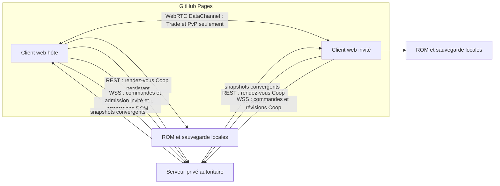

# Architecture extensible — NG+ local et serveur multijoueur privé

## Statut du document

Ce document décrit l’état réel du projet au 28 août 2026. Le New Game+ reste un
ensemble de modules locaux déjà raccordés au jeu. La décision d’architecture
suivante est maintenant figée pour commencer le multijoueur sans déplacer le
runtime ou les données du jeu vers un serveur :

1. `web/` est un client statique autonome, destiné à GitHub Pages ;
2. `server/` est un service générique autonome, destiné à un VPS Hostinger ;
3. le VPS fournit l’authentification, les amis, la présence, un rendez-vous Coop
   persistant, un matchmaking non classé et la signalisation WebRTC de
   Trade/PvP, un coffre privé d’enveloppes chiffrées et une autorité générique
   de session partagée ;
4. la Coop passe du rendez-vous REST directement au serveur WSS, source de
   vérité des révisions, participants et déplacements, sans dépendre de WebRTC
   ni d’un DataChannel. WebRTC reste réservé à Trade, au PvP et à la
   compatibilité de migration ;
5. la ROM et les sauvegardes en clair ne sont jamais envoyées au VPS. L’hôte
   valide avec sa ROM la position initiale de l’invité et les changements de
   carte avant que le serveur accepte leur mutation.

Le parcours social, le matchmaking et l’échange P2P sont maintenant raccordés à `main.ts` :
accès rapide depuis le menu burger, création de compte et connexion persistante,
hub `Classement` / `Échange` / `PvP` / `Coop`, choix ami ou aléatoire, actions
d'amis typées, accord explicite de l'invité, invitations, previews locales,
double acceptation, commit transactionnel et reprise durable après
coupure. Un journal
local versionné conserve uniquement les données fonctionnelles acceptées et
verrouille la partie jusqu’à la réconciliation avec le même pair. La présence,
la marche/course, les transitions de carte et une première tranche atomique
d’interactions scénario par objet ou coordonnée sont raccordées au serveur
autoritaire avec progression durable et acquittements de reprise. Les combats
partagés restent une tranche séparée. Au titre, le
sas de compte précède désormais le catalogue de sauvegardes ; il sélectionne le
stockage local ou le cache serveur/compte, dérive la clé des comptes autorisés et
réconcilie les trois slots avec le coffre opaque avant de publier le catalogue.
Patreon et les services de plateforme plus larges restent hors du périmètre actuel.

## Légende des statuts

- **Terminé et raccordé** : le module contribue aux ports de gameplay actifs,
  possède des tests unitaires et est sauvegardé lorsqu’il porte un état mutable.
- **Validé sur ROM** : un probe facultatif a aussi vérifié une propriété avec la
  ROM HeartGold française chargée localement.
- **En cours** : le correctif est présent partiellement ou en cours d’intégration ;
  le résultat attendu est documenté, mais il ne doit pas encore être considéré
  comme une garantie validée.
- **Reporté** : volontairement hors du périmètre actuel.

## Résumé exécutif

| Domaine | État actuel |
| --- | --- |
| Création NG+ depuis le titre | Raccordée : source ayant terminé la Ligue de Kanto, destination séparée, choix cumulables et validation avant fermeture du draft. |
| Profil et registre | Profil JSON V1 strict, modules révisionnés, configurations validées et application initiale transactionnelle. |
| Dix règles de gameplay demandées | Terminées et raccordées : Tous les Pokémon, Pokémon visibles, combats en duo/2v1, Nuzlocke, Hardcore, mort définitive, Randomizer, Monotype, Solo Run et Équipe Évoli. |
| Options de transfert | Terminées : conservation facultative du Pokédex et de l’argent de la partie source. |
| Composition des modules | Ordre canonique indépendant de l’ordre affiché dans le profil, veto restrictif et tests de combinaisons/permutations. |
| Sauvegarde des règles | Enveloppe d’extensions versionnées raccordée aux trois slots locaux ; reprise stricte des états NG+ sélectionnés. |
| Pokémon visibles et Safari | Raccordés au monde, au rendu et aux interactions. Placement/déplacement par surface et zone Safari validés, y compris par probe ROM. |
| Robustesse des slots et de la reprise | Terminée et testée : un slot corrompu reste occupé, visible et supprimable explicitement ; la reprise est transactionnelle et revient au menu en cas d’échec. |
| Jeu normal hors ligne | Ports neutres, aucun état NG+ créé et aucun changement de règle. Le choix explicite « Mode local » n’effectue aucune synchronisation cloud ; un compte en ligne peut la terminer au titre avant le catalogue. |
| Protection du build | Raccordée comme défense en profondeur ; elle augmente le coût de copie et contrôle l’intégrité, sans prétendre rendre un client web inviolable. |
| Client statique | Projet autonome `web/`, build protégé et workflow GitHub Pages ; connexion, amis, invitations et échange P2P raccordés à l’interface du jeu. |
| Hub multijoueur et amis | Raccordés : session établie au titre avant le catalogue, entrée burger sans second formulaire de compte au même niveau que Pokématos, raccourcis `Classement` / `Échange` / `PvP` / `Coop`, choix aléatoire/ami, trois actions typées sur chaque ami et commandes distinctes ajouter/accepter/refuser/annuler/retirer. |
| Service VPS générique | Projet autonome `server/` : comptes, sessions révocables, rôles et droits génériques, amis, présence, rendez-vous Coop persistants, matchmaking et signalisation WebRTC de Trade/PvP, coffre privé d’objets AES-GCM et sessions partagées autoritaires à deux membres. |
| Rendez-vous et matchmaking | La Coop utilise un contrat REST persistant et idempotent pour ami ou aléatoire, avec rôles et `sessionId` attribués par le serveur avant WSS. Trade/PvP conservent les snapshots RTC stricts `idle | queued | matched`, le polling HTTP coalescé, l’annulation, le `negotiationId` lié et l’autorisation éphémère sans création d’amitié. |
| Classement | Volontairement indisponible : aucune route de score/résultat et aucune présentation de données non attestées. |
| Échanges entre joueurs | Raccordés en P2P : offre révisable, preview des deux côtés, acceptation exacte bilatérale, escrow local, sauvegarde avant publication, compteurs, Pokédex, évolutions d’échange et reprise exactement-once après reconnexion. |
| Coop et combats | Entrée Coop raccordée sans P2P : rendez-vous REST persistant, admission de l’invité par la ROM de l’hôte, puis snapshots, marche/course et progression durable via l’autorité WSS. Transitions inter-cartes et interactions scénario sûres par objet ou coordonnée ne sont admises qu’après reproduction ROM exacte par l’hôte, commit serveur durable, application locale et acquittement. Les combats partagés restent à brancher. |
| Cloud et Patreon | Synchronisation raccordée avant le catalogue : cache isolé par serveur/compte, import local optionnel et explicitement consenti avec binding serveur/compte/ROM et contrôles CAS, clé déterministe PBKDF2 liée au compte, objets opaques par slot, tombstones durables, ETags et mutation logique serveur. Sur une même descendance, la version la plus récente converge automatiquement ; deux modifications hors ligne concurrentes restent un choix explicite et une horloge d’appareil fausse ne peut pas faire régresser la campagne. Les droits `online` / `premium-client` / `cloud-storage` sont raccordés ; le fournisseur Patreon reste préparé mais inactif. |

## Invariants non négociables

1. La ROM reste locale et n’est jamais envoyée à un serveur.
2. Une partie normale ne dépend d’aucun profil NG+, d’aucun service réseau et
   d’aucun entitlement distant.
3. En l’absence de profil, tous les ports utilisent leur implémentation de base :
   rencontres, Safari, combats, progression, soins, équipe et monde conservent
   leur comportement HGSS normal.
4. Les catalogues décodés de la ROM restent immuables. Les modules produisent
   des décisions, des overlays ou des projections ; ils ne réécrivent pas les
   données sources.
5. Un module optionnel dépend des contrats de domaine, jamais directement d’un
   autre module optionnel.
6. Les combinaisons sont résolues dans un seul compositeur, selon un ordre
   explicite et testé ; elles ne dépendent pas de l’ordre des imports ni de
   l’ordre des choix du joueur.
7. Une mutation d’équipe, une capture, un soin ou une action refusée doit être
   arrêtée avant consommation de l’objet, publication d’état ou tirage RNG.
8. Le profil et chaque état runtime sont validés à la restauration. Une clé,
   version ou configuration inconnue provoque une erreur explicite, pas une
   interprétation silencieuse.
9. Une partie normale n’émet aucune clé `new-game-plus.*`.
10. Les gros systèmes restent hors de `main.ts`. Ce fichier demeure un point de
    composition historique dont le plafond de lignes ne peut que diminuer.
11. `server/` reste générique, autonome et sans import depuis `web/` : aucun code,
    catalogue, nom de domaine métier ou donnée spécifique à la ROM n’y entre.
12. Le VPS est l’autorité de la Coop et n’accepte que ses commandes et snapshots
    génériques strictement typés. Il ne relaie aucun message applicatif libre ;
    sa signalisation WebRTC est limitée à Trade/PvP et à la compatibilité de
    migration, entre pairs autorisés et sous `negotiationId` exact.
13. Le joueur utilise un compte, jamais un secret à copier-coller. La session
    opaque créée par le VPS reste interne au client et n’entre ni dans une URL,
    ni dans une variable publique Vite, ni dans Git ou `dist/`.
14. Un état runtime n’est jamais chiffré et envoyé directement : la sauvegarde
    complète passe d'abord par le parseur data-only exact et son attestation.
    Une extension inconnue reste locale et bloque la synchronisation du slot.
15. La session ou le mode local est choisi avant toute lecture du catalogue de
    sauvegardes. Le hub multijoueur réutilise cette décision et ne demande jamais
    de se reconnecter au milieu d’une partie.
16. Avant publication, tous les appareils du LAN joignent directement le vrai
    serveur privé HTTPS/WSS ; aucun tunnel n’est requis. Lors de l’exposition
    publique, un tunnel éventuel couvre uniquement ce serveur. Un client servi
    sur localhost pointe vers son URL sans tunnel propre.

## Architecture modulaire raccordée

Le bundle `web/src/game/extensions/gameplayExtensionPorts.ts` expose les ports
étroits consommés par les domaines :

- format et roster des combats ;
- routage et identité des rencontres sauvages ;
- observation du démarrage réel d’une rencontre et de son résultat détaillé ;
- validation des actions de combat ;
- progression et plafond de niveau ;
- équipe initiale, éligibilité et mutations d’équipe ;
- politique de soin ;
- acteurs dynamiques et interactions du monde.

`gameplayExtensionRuntime.ts` fournit une façade stable aux contrôleurs déjà
créés. Activer ou quitter une campagne remplace uniquement sa cible de
délégation : une ancienne règle ne reste pas capturée dans une UI ou une session.

`newGamePlusGameplayRuntime.ts` est l’unique point de composition NG+. Il :

- valide le profil, ses révisions et ses incompatibilités ;
- construit uniquement les runtimes sélectionnés ;
- ordonne leurs contributions de façon canonique ;
- restaure les états versionnés pour une reprise ;
- produit le snapshot des extensions au moment de sauvegarder ;
- préserve les extensions étrangères à NG+.

Les règles se composent ainsi :

- les transformations de roster, d’identité sauvage et d’équipe initiale sont
  séquentielles ;
- tous les observateurs concernés reçoivent l’événement ;
- le premier veto d’action, de soin ou d’équipe l’emporte ;
- le plafond de niveau le plus bas l’emporte ;
- les fournisseurs d’acteurs dynamiques sont fusionnés puis dédupliqués ;
- les ports à remplacement unique utilisent la dernière contribution déclarée.

Le registre `newGamePlusRegistry.ts` applique les effets initiaux, comme le
transfert d’argent ou de Pokédex, sur une copie de la destination. Si un module
échoue, l’état de départ n’est pas partiellement modifié.

## Création et activation depuis le titre

Le NG+ est débloqué localement par le drapeau système de fin de jeu HGSS ou par
le témoin de compatibilité des anciennes sauvegardes ayant réellement exécuté
la scène du Panthéon. Cette preuve locale ouvre une fonctionnalité hors ligne ;
elle n’est ni une preuve d’achat ni une validation Patreon.

Le flux de création actuel :

1. recense les sauvegardes ayant terminé la Ligue de Kanto ;
2. exige un autre emplacement réellement vide ;
3. affiche les douze modules installés, tous facultatifs et cumulables selon les
   règles de compatibilité ;
4. construit un profil V1 avec la ROM, le slot source, le joueur, la date de fin,
   l’identifiant et la révision de chaque module ainsi que sa configuration ;
5. prévalide le runtime complet avant de démarrer l’introduction ;
6. applique les transferts initiaux au nouvel état sans modifier la sauvegarde
   source ;
7. réserve la première écriture au slot cible sans écrasement implicite.

L’interface sait choisir le type Monotype et l’espèce du Solo Run directement
depuis les catalogues de la ROM. Les types sans aucune espèce HGSS complète —
notamment l’entrée technique `----` — ne sont pas proposés. Les autres modules
utilisent actuellement leur configuration standard validée : leurs seeds,
plafonds Hardcore et affectations Évoli sont bien stockés dans le profil, mais
l’écran ne fournit pas encore d’éditeur texte avancé pour ces valeurs.

Le draft reste ouvert si la validation du registre, une incompatibilité ou
l’activation runtime échoue. Les choix déjà saisis sont conservés ; l’overlay ne
se ferme qu’après confirmation positive de la création.

## Modules hors ligne terminés

### Conserver le Pokédex

Recopie les espèces vues/capturées, les formes et les langues de la partie
terminée. La configuration standard conserve aussi le Pokédex national. La
copie est indépendante : la source n’est jamais mutée.

### Conserver l’argent

Transfère un pourcentage validé de l’argent source, borné au maximum HGSS de
999 999 ₽. L’interface utilise actuellement le réglage standard de 100 %.

### Nuzlocke

La première rencontre réellement démarrée d’une section de carte devient la
seule tentative capturable de cette section. Une rencontre seulement préparée,
annulée avant démarrage ou un acteur visible seulement affiché ne consomme rien.

L’observateur suit l’`instanceId` de la cible et distingue capture, K.O., fuite et
autres fins de combat. Les Balls normales et l’action Ball du Safari restent
autorisées uniquement pendant la tentative active. L’état des sections et leur
issue est sauvegardé sous `new-game-plus.nuzlocke` V1.

Les quêtes Tous-les-Pokémon utilisent une section virtuelle propre à chaque
espèce (`0xf000 + speciesId`). Elles ne consomment donc ni la tentative de la
route physique de l’autel, ni celle d’une autre quête placée au même endroit.

### Hardcore

Le module fournit une table explicite de paliers de progression et de plafonds
pour le prochain combat majeur. Le plafond est appliqué aux gains d’EXP, au
Super Bonbon et à la Pension. La plus haute progression déjà observée est
sauvegardée afin qu’un rechargement ou un état de campagne régressif ne réduise
pas artificiellement le palier atteint.

En combat, les objets tactiques du Sac sont interdits. Les Balls restent
autorisées, car elles sont une mécanique de capture nécessaire à Nuzlocke et à
Tous-les-Pokémon. Le changement gratuit entre deux Pokémon adverses est refusé ;
un changement volontaire qui coûte un tour conserve le chemin normal du moteur.
L’état est sauvegardé sous `new-game-plus.hardcore` V1.

### Mort définitive

Tout Pokémon joueur observé K.O. est enregistré par son `instanceId` persistant,
indépendamment de l’issue finale du combat. Une instance morte :

- n’est plus éligible au combat ni aux remplacements forcés ;
- ne peut plus recevoir de soin ;
- ne peut pas être réintroduite dans l’équipe après en être sortie.

Les événements simples, doubles et Safari passent par le même observateur de
résultat. L’état est sauvegardé sous `new-game-plus.permanent-death` V1.

### Randomizer

Le Randomizer transforme de manière déterministe :

- le starter natif ;
- les rencontres ambiantes terrestres, Surf, pêche, rencontres forcées et
  Safari qui traversent le port d’identité ;
- les rosters des Dresseurs standard, tag, multi et Maison des Dresseurs.

Le mapping dépend d’un seed public, d’une version d’algorithme et d’une clé
stable de domaine. Il ne consomme ni le RNG HGSS ni `Math.random`, de sorte
qu’une reprise et une permutation des modules conservent le résultat.

Les roamers et les sauvages scriptés restent natifs : leur espèce peut être
liée à des drapeaux ou à la progression de la campagne. Solo Run et Équipe
Évoli restent propriétaires de leur équipe initiale. Avec Monotype, le starter
randomisé est choisi uniquement parmi les espèces complètes du type demandé.
Le module est sans état runtime séparé : son seed et sa révision sont dans le
profil.

### Tous les Pokémon accessibles

Le plan valide d’abord un catalogue national complet de 493 espèces. Il combine
trois sources sans modifier les tables ROM :

1. les sources natives prouvées stables hors tables sauvages ;
2. des ancrages déterministes dans des slots terre, Surf ou pêche ;
3. des quêtes persistantes pour les légendaires/fabuleux non garantis et pour
   une espèce ordinaire qui ne pourrait pas recevoir de slot sûr.

Chaque espèce ordinaire non garantie hors table reçoit son propre ancrage, même
si elle existe déjà dans une table native. Cette règle est intentionnelle : si
Randomizer transforme d’abord toutes les espèces natives, l’overlay
Tous-les-Pokémon restaure encore chacun des ancrages et garantit réellement la
couverture `1..493`, sans importer ni connaître le module Randomizer.

Un ancrage ne remplace jamais la dernière occurrence non garantie de l’espèce
native qu’il recouvre. Le niveau, le taux, la méthode, l’horaire et le tirage RNG
du slot restent ceux de la ROM ; seule l’identité finale est superposée.

La carte Safari dédiée `357` est explicitement exclue des sources de slots
ordinaires et des emplacements d’autels. En session Safari, les tables normales
de cette carte ne sont pas matérialisées ; les utiliser aurait créé des
placements ou quêtes fantômes.

#### One-shots et roamers natifs

La liste des espèces déjà garanties n’est pas déduite de la simple présence
d’un numéro dans les scripts. Le catalogue `mapEncounterLandmarks.ts` analyse
les commandes ROM `WildBattle`, leur flux de contrôle, le groupe d’œuf
« Inconnu » et le drapeau de disparition de l’objet. Les roamers sont ajoutés
depuis leur définition native versionnée.

Pour la ROM HeartGold française `IPKF`, la preuve actuelle donne :

`144, 145, 146, 150, 243, 244, 245, 249, 250, 380, 382`.

Pour SoulSilver (`IPG*`), la variante attendue remplace Latias/Kyogre par
Latios/Groudon :

`144, 145, 146, 150, 243, 244, 245, 249, 250, 381, 383`.

Rayquaza n’est volontairement pas ajouté à cette liste « native » : son combat
dépend de la possession de Kyogre et Groudon. Une preuve transitive séparée le
classe toutefois comme accessible sans quête propre lorsque, et seulement
lorsque :

- la ROM prouve un landmark Rayquaza terminal avec un unique identifiant de
  disparition ; plusieurs analyses donnant le même identifiant sont acceptées,
  deux identifiants distincts rendent la preuve ambiguë et conservent la quête ;
- le one-shot météo propre à la version est lui-même prouvé et figure dans les
  sources garanties ;
- le premier passage autonome du plan couvre ce légendaire et sa contrepartie
  de l’autre version.

Sur la ROM HeartGold française, le probe confirme l’unique drapeau Rayquaza
`722`. Le plan final couvre toujours exactement `1..493`, ne crée donc plus de
quête 384 et conserve la quête 383 qui rend Kyogre accessible dans cette
version. SoulSilver applique la règle symétrique. Si un landmark, un drapeau ou
une dépendance manque, le plan reste conservateur et garde la quête Rayquaza.
Les autres événements non prouvés, échanges et exclusivités non garanties
restent eux aussi couverts par un ancrage ou une quête.

#### Quêtes persistantes

Les quêtes ont une exigence déterministe d’argent, de combats gagnés ou de
captures d’un type. Jusqu’à douze autels sont choisis sur des cartes sauvages
distinctes, sur une case terrestre libre et avec une case d’approche réellement
atteignable depuis une entrée de carte. Les quêtes disponibles tournent sur ces
emplacements ; un combat actif masque les autres autels.

Une interaction prépare un combat sauvage scripté normal. L’acteur n’est pas
consommé avant le démarrage effectif. Capture et K.O. sont terminaux et
persistés ; une fuite ou une interruption rend la quête de nouveau disponible.
L’état est sauvegardé sous `new-game-plus.all-pokemon-accessible` V1.

La reprise reste compatible avec les premiers états V1 qui contenaient encore
une quête 384. Une entrée `locked` ou `available` sans combat actif est retirée
sans inventer d’issue. Une entrée `captured` ou `defeated` pose l’unique drapeau
ROM de disparition sur la copie de l’état de terrain, pendant la tentative de
reprise transactionnelle : le Rayquaza natif ne peut donc pas réapparaître. Un
combat de quête encore actif est refusé explicitement. Si la reprise échoue, le
rollback conserve l’ancien terrain et ses drapeaux inchangés.

### Pokémon visibles, y compris le Safari

Le module matérialise les rencontres déjà préparées par le moteur hôte sous
forme d’acteurs dynamiques bloquants et interactifs. Il ne possède pas un second
moteur de combat : l’interaction renvoie vers le chemin sauvage existant, et
l’acteur n’est retiré qu’après confirmation du démarrage effectif.

Les candidats normaux couvrent les 100 valeurs du tirage pondéré de la table
pour la terre et le Surf. Pêche et roamers conservent leurs déclencheurs HGSS
spécifiques. L’identité composée — Randomizer puis Tous-les-Pokémon le cas
échéant — est appliquée avant l’affichage, de sorte que le sprite, l’interaction
et le combat décrivent la même espèce.

Au Safari, le catalogue visible couvre jusqu’à 120 clés persistantes : six
emplacements de zone × deux méthodes (terre/Surf) × dix slots actifs. Le nombre
d’acteurs simultanés reste borné par `actorsPerMap` (1 à 8) ; les rencontres
retirées et les cycles de repeuplement sont persistés pour faire tourner les
candidats sans gonfler le monde actif.

Le dernier correctif de sûreté visible est terminé et validé :

- un candidat terrestre ne peut apparaître ou errer que sur une case terrestre
  praticable ;
- un candidat Surf reste sur une case Surf et hors cascade ;
- les limites de carte, warps, objets, événements de coordonnées, arrière-plans,
  PNJ, joueur et autres acteurs bloquants sont exclus ;
- au Safari, l’acteur reste dans le même `areaSlot` et sur la surface qui a
  produit sa rencontre.

Ces contrôles ne sont activés que par le host du module visible ; ils ne changent
pas les déplacements ni les rencontres d’une partie normale. L’état des acteurs,
rencontres retirées et générations de population est sauvegardé sous
`new-game-plus.visible-wild-pokemon` V1.

### Tous les combats en duo et sauvage 2v1

Les combats Dresseur simples et les combats sauvages compatibles demandent le
moteur double. Le starter natif est complété par une seconde instance si aucune
règle d’équipe explicite ne fournit déjà assez de membres.

- Un Dresseur simple avec un seul Pokémon ordinaire reçoit une seconde
  définition indépendante ; les identités d’instances restent distinctes.
- Les équipes tag/multi, la Maison des Dresseurs et les tutoriels conservent
  leur format spécialisé.
- Un sauvage ambiant, scripté ou légendaire reste unique : avec deux combattants
  aptes, le format est un vrai 2v1, jamais un légendaire cloné.
- Le 2v1 possède ses chemins de commande, ciblage, capture, fuite normale et
  objet de fuite.
- Si l’attrition, Solo Run ou une autre règle ne laisse qu’un seul combattant
  éligible, le moteur double reste actif avec un unique slot joueur, sans clone
  ni commande fantôme. Il affronte donc seul les deux adversaires d’un Dresseur
  lorsque le roster adverse en possède deux. Face à un sauvage unique, le même
  moteur représente naturellement un 1v1. Zéro combattant reste une
  défaite/invariant explicite.
- La vérification ROM `PartyCheckForDouble` accepte ce slot unique seulement
  lorsque le module Duo est actif ; le jeu normal exige toujours deux Pokémon.
- Le Safari garde toujours son moteur distinct et n’est pas converti en double.

Le module n’a pas d’état runtime hors combat.

### Monotype

Le type primaire ou secondaire est accepté. Le starter est remplacé, si
nécessaire, par une espèce HGSS complète du type choisi. Une espèce hors type
peut encore être acquise et stockée, mais elle ne peut pas combattre. Une
évolution qui ferait perdre le type à un membre jusque-là valide est refusée
avant mutation.

Le type sélectionné est sauvegardé sous `new-game-plus.monotype` V1 et doit
correspondre à la configuration du profil à la reprise.

### Solo Run

La campagne commence avec l’espèce et la forme choisies. Après publication
transactionnelle de l’équipe initiale, son `instanceId` est lié au runtime :
cette instance est l’unique combattant autorisé et ne peut être retirée ou
remplacée. Son évolution normale conserve l’identité et reste possible.

L’instance liée est sauvegardée sous `new-game-plus.solo-run` V1. Les autres
Pokémon peuvent être acquis pour les besoins de collection, mais ne deviennent
pas des remplaçants de combat.

### Équipe Évoli

La campagne commence avec six instances distinctes d’Évoli. Chacune est liée à
une évolution HGSS et à son type : Aquali, Voltali, Pyroli, Mentali, Noctali et,
par défaut, Phyllali. Une instance ne peut évoluer que vers sa cible affectée ;
les ajouts, remplacements ou retraits de membres vivants sont refusés.

Avec Mort définitive, un membre mort peut être retiré sans être remplacé : la
partie continue alors avec cinq membres, puis moins si nécessaire. Les six IDs
et affectations sont sauvegardés sous `new-game-plus.eevee-team` V1.

## Compatibilités et incompatibilités

### Incompatibilités strictes

- Solo Run + Équipe Évoli.
- Équipe Évoli + Monotype.

### Compatibilité conditionnelle

- Solo Run + Monotype est accepté seulement si l’espèce Solo possède le type
  sélectionné. Sinon la création/reprise est rejetée avant le gameplay.

### Combinaisons explicitement adaptées et testées

- Randomizer + Monotype : le starter randomisé respecte le type.
- Randomizer + Solo Run ou Équipe Évoli : la règle d’équipe explicite garde la
  propriété du starter.
- Randomizer + Tous les combats en duo : randomisation puis adaptation du
  roster, quel que soit l’ordre des sélections dans le profil.
- Solo Run + Tous les combats en duo : l’unique instance Solo occupe le seul
  slot joueur et conserve le moteur double.
- Randomizer + Tous-les-Pokémon : les ancrages finaux garantissent encore les
  493 espèces dans les deux ordres de profil.
- Nuzlocke + Hardcore : la capture reste possible avec une Ball.
- Nuzlocke + Tous-les-Pokémon : chaque quête utilise une tentative virtuelle
  indépendante de la route et des autres quêtes.
- Mort définitive + duo : le dernier combattant valide continue seul dans le
  moteur double.
- Mort définitive + Solo Run : aucun compagnon ne remplace l’instance Solo morte.
- Mort définitive + Équipe Évoli : retrait du mort autorisé, remplacement
  interdit.
- Pokémon visibles + Randomizer/Tous-les-Pokémon : l’acteur affiche l’identité
  finale composée et démarre exactement la rencontre qu’il représentait.

Les tests de permutations vérifient que l’ordre d’écriture des modules dans le
profil ne change pas ces résultats.

## Sauvegardes versionnées et reprise

Le stockage local conserve trois slots indépendants avec écriture en staging et
CRC32. Le payload HGSS reste en version 1 et accepte facultativement :

- un profil `pokemaster-hgss-new-game-plus` V1 ;
- une enveloppe `extensions` où chaque clé possède sa propre `version` et une
  valeur JSON stricte.

À la sauvegarde, le runtime reconstruit uniquement les clés NG+ sélectionnées et
préserve les autres extensions. À la reprise, il refuse :

- une extension NG+ inconnue ;
- une version inconnue ;
- un état absent pour un module sélectionné et stateful ;
- un état présent pour un module non sélectionné ;
- une configuration runtime qui ne correspond plus au profil.

Les modules stateful sont Nuzlocke, Hardcore, Mort définitive,
Tous-les-Pokémon, Pokémon visibles, Monotype, Solo Run et Équipe Évoli.
Randomizer, Tous les combats en duo et les deux transferts initiaux sont
entièrement décrits par le profil ou n’ont pas d’état persistant supplémentaire.

Une ancienne partie normale sans enveloppe reste valide. Quand aucun profil
n’est actif, le runtime est remis sur les ports de base et refuse qu’un état NG+
connu soit injecté seul.

### Robustesse sauvegarde/reprise — validée

L’inspection distingue maintenant trois états sans confondre corruption et
emplacement libre : vide, lisible ou corrompu. Des octets bruts invalides, un
payload HGSS invalide et un staging interrompu restent visibles comme un slot
occupé. Le catalogue et l’interface expliquent l’erreur, n’offrent que l’action de
suppression dédiée et excluent ce slot des sources comme des destinations NG+.
La suppression exige une confirmation et un jeton lié aux octets inspectés ; si
une écriture plus récente les remplace entre-temps, elle n’est pas supprimée.

La reprise prépare un état cloné, restaure le profil et ses extensions, applique
les migrations de terrain des modules, reconstruit la session puis ne publie le
résultat qu’après succès. Une erreur d’activation, de validation, de chargement
de carte ou de reconstruction restaure le profil, les extensions, les ports et
la session précédents. Le menu du titre reste accessible et reçoit un message
d’erreur. Les neuf fichiers de tests ciblés de ce lot totalisent 40 tests verts.

## Garantie du mode normal et hors ligne

Sans profil New Game+ et sans ouverture explicite d’une session multijoueur :

- `baseGameplayExtensionPorts` est la seule cible active ;
- aucun acteur Pokémon dynamique n’est créé ou rendu ;
- les rencontres par pas, la pêche, les roamers et le Safari suivent leurs
  chemins natifs ;
- les formats simple/double natifs restent inchangés ;
- aucun veto Nuzlocke, Hardcore, Monotype, Solo, Évoli ou Mort définitive ne
  s’applique ;
- les gains d’EXP, plafonds, soins, captures, cadeaux, échanges, Pension,
  évolutions et transferts PC conservent leurs règles de base ;
- aucune clé `new-game-plus.*` n’est ajoutée à la sauvegarde ;
- aucun réseau, compte, serveur ou contrôle Patreon n’est appelé.

Les contrôles de terrain ajoutés pour les Pokémon visibles vivent dans le host
NG+ et ne modifient donc pas le déplacement normal. De même, le plan
Tous-les-Pokémon est une vue dérivée : les tables ROM restent intactes pour une
campagne sans ce module.

## Batteries de test temps réel réservées au développement

Le navigateur possède maintenant un banc de test local activé uniquement avec
`npm run test:live`, donc `?test=1`. Son format texte, ses exemples et son mode
d’emploi sont dans `web/debug-tests/README.md`.

Le système reste séparé en trois modules :

- `realtimeTestScript.ts` valide entièrement le fichier avant exécution,
  borne sa taille, ses durées, ses répétitions et ses touches ;
- sa machine temporelle injecte `press/release` dans le même `GameInputRouter`
  que clavier, manette et pointeur, puis libère toujours une touche lors d’un
  arrêt, d’une erreur, d’une perte de focus ou d’un changement d’onglet ;
- `realtimeBattleDebug.ts` adapte seulement les combats actifs et renvoie les
  événements normaux de K.O./résultat aux queues de présentation existantes.

Le godmode appartient à l’objet de session courant dans un `WeakSet` et ne peut
donc ni entrer dans une sauvegarde ni se propager au combat suivant. Sa
réconciliation a lieu avant les observateurs de résultat NG+/Nuzlocke. Instant
kill et suicide ne sont admis que lorsque la file et la phase de commande sont
vides. L’allié IA d’un combat Multi n’est jamais protégé ou sacrifié.

Cette protection est une réconciliation de survie après le calcul du tour, pas
un rembobinage : PP, RNG, objets et effets non létaux conservent le résultat du
tour réel. Elle empêche le K.O. et la défaite d’atteindre les observateurs, mais
ne prétend pas rendre le tour sans effet.

Le Safari n’a pas de PV joueur ni de résultat victoire/défaite : ces trois
commandes y répondent explicitement « non applicable ». Le scénario Safari
vérifie chacun de ces refus, puis teste son interface et sa sortie avec les
touches réelles, sans transformer une fuite en capture ou en faux K.O.

La session `?test=1` est jetable. Sauvegarde, autosauvegarde, effacement de slot,
options et métadonnées NG+ restent fonctionnels mais écrivent dans une
surcouche mémoire ; le stockage navigateur réel reste intact et le remplacement
du cache ROM est refusé. Le démarrage `debugMap` historique bénéficie du même garde. Le build protégé recherche les
marqueurs du banc dans JavaScript, CSS et HTML ; aucun panneau, libellé, raccourci
ou moteur de test n’est présent dans `dist/`.

Les fichiers livrés couvrent l’ouverture de campagne déjà cartographiée, le
terrain/menu, godmode + victoire, victoire immédiate, défaite volontaire et
sortie Safari. La campagne longue doit être complétée chapitre par chapitre à
mesure que les routes sont stabilisées ; `WAIT`, `EXPECT`, `PRESS-UNTIL`, les
checkpoints et les rapports TXT évitent de la coder comme une suite de délais
fragiles.

### Gate du premier badge

Le chapitre allant d’une nouvelle partie au Badge Zéphyr possède désormais
trois preuves complémentaires :

- le parcours headless rejoue les vrais inputs et scripts ROM jusqu’à la carte
  135, observe la victoire contre Albert, Dresseur 20, puis le badge 0 ;
- la matrice NG+ exécute Albert sur les 640 compositions canoniques de modules,
  soit 320 combats simples, 320 doubles et 128 doubles avec un seul Pokémon
  joueur ;
- la matrice exhaustive factorisée IPKF couvre les 17 Monotypes, 493 choix
  Solo et 716 couples Solo+Monotype compatibles. Elle énumère bijectivement
  157 184 gameplays et 628 736 profils avec transferts, active et reprend les
  2 456 configurations d’équipe, puis exécute les sept classes de combat qui
  diffèrent matériellement.

Le 25 août 2026, `campagne-premier-badge.txt` a aussi réussi dans un navigateur
headless réel en 7 min 40 s : nouvelle sauvegarde jetable, combats sauvages,
rival 497, Dresseur de Route 30 numéro 47, Albert 20 avec Roucool niveau 9 et
Roucoups niveau 13, badge, sortie de script et sauvegarde finale prête.

Cette réussite temps réel concerne uniquement la campagne normale. Les parcours
temps réel du premier badge dans les variantes NG+ ont été arrêtés à la demande
le 26 août 2026 avant validation complète. Les matrices unitaires et probes ROM
restent des preuves automatisées utiles, mais ce document ne les présente pas
comme une validation temps réel des variantes NG+.

Cette correction distingue volontairement l’identité du combat des
`TrainerFlags`. Le script original d’Albert ne pose jamais le drapeau 20 : il
attribue le badge et marque seulement les élèves 29/50. Le gate exige donc une
victoire réellement observée contre le Dresseur 20, sans injecter de drapeau
artificiel dans l’état normal.

## Tests et probes ROM

Les tests unitaires couvrent les décodeurs stricts, les modules, leurs états,
la création UI, l’activation/reprise, les ports, les observateurs, le vrai 2v1,
les combinaisons et les permutations d’ordre.

Les probes ROM sont facultatifs : ils sont ignorés si `RUN_ROM_PROBES=1` n’est
pas fourni ou si la ROM locale n’existe pas. Ils ne publient ni ne copient la
ROM. Les contrôles NG+ principaux sont :

- `allPokemonQuestLocationPlannerRomProbe.test.ts` : douze autels approchables
  depuis une entrée, interaction WorldSession, liste native IPKF, drapeau
  Rayquaza unique `722`, absence de quête 384, contrepartie 383 et couverture
  exacte `1..493` ;
- `hgssVisibleSafariEncounterCandidatesRomProbe.test.ts` : couverture des dix
  slots actifs par couple zone/méthode du Safari ;
- `newGamePlusDynamicPokemonWorldHostRomProbe.test.ts` : 1 000 déplacements
  Safari restant sur la bonne surface, dans le même `areaSlot` et hors
  événements ;
- les tests du host visible incluent aussi 1 000 déplacements normaux et des
  scénarios synthétiques Safari.

Exemple ciblé, depuis `web/` :

```sh
npx vitest run src/game/newGamePlus src/game/battle/fieldDoubleWildBattle.test.ts
RUN_ROM_PROBES=1 ROM_AUDIT_PATH=/chemin/vers/la-rom.nds \
  npx vitest run \
  src/game/newGamePlus/modules/allPokemonQuestLocationPlannerRomProbe.test.ts \
  src/game/encounters/hgssVisibleSafariEncounterCandidatesRomProbe.test.ts \
  src/game/newGamePlus/newGamePlusDynamicPokemonWorldHostRomProbe.test.ts
npx tsc --noEmit
npm run lint
npm run check:architecture
```

Le correctif Rayquaza et sa migration V1 passent 30 tests unitaires ciblés,
dont le relais du runtime composite et le rollback des drapeaux. Son probe ROM
IPKF passe également. Le lot sauvegarde/reprise passe 40 tests ciblés et le lot
de création Monotype/draft en passe 8. TypeScript, ESLint ciblé et le contrôle
d’architecture sont verts après ces changements.

La validation globale hors navigateur du 27 août 2026 est verte : 560 fichiers
de tests passent et 55 sont ignorés parce qu’ils dépendent d’un environnement
ou d’une sonde optionnelle, soit 3 731 tests réussis et 107 ignorés sur 3 838.
Les probes qui exigent la ROM n’ont pas été relancés pendant cette phase réseau.
Le build GitHub Pages réel sous `/PokeMaster/`, puis sa vérification d’intégrité
sans variables de build, passent sur les 29 fichiers distribués.

Le sous-ensemble `src/online` + `src/game/multiplayer` passe séparément 134 tests,
dont la provenance des routes/liens, la perte du signaling après connexion, les
réponses tardives et les reprises sous backpressure.

## Allègement des fichiers historiques

La logique NG+ est répartie dans `web/src/game/newGamePlus/`, les politiques de
domaine et les coordinateurs hôtes. `main.ts` conserve le câblage du navigateur,
mais pas les règles internes des modules.

`check-source-boundaries.mjs` applique un plafond de dette aux monolithes
historiques. Au moment de ce document, `main.ts` compte 5 744 lignes et atteint
son plafond actuel de 5 744 lignes. Son poids UTF-8 est également plafonné à
326 751 octets pour qu'un compactage artificiel ne puisse pas masquer une
nouvelle croissance. Toute nouvelle fonctionnalité doit vivre dans un module de
domaine ; les plafonds sont abaissés après extraction et ne doivent pas remonter.

## Protection du build, sans promesse d’inviolabilité

`npm run build` exécute TypeScript, Vite puis `protect-build.mjs`. Le résultat
`dist/` bénéficie notamment de :

- minification et renommage des identifiants JavaScript ;
- noms d’artefacts neutres avec empreintes longues ;
- absence exigée de sources TypeScript, source maps, archives, ROM, sauvegardes,
  clés privées et plusieurs formats de secrets connus ;
- refus du JavaScript public brut et des variables publiques dont le nom
  ressemble à un secret ;
- CSP canonique, scripts inline refusés, politique `no-referrer` et SRI sur les
  ressources référencées par `index.html` ;
- manifeste SHA-384 couvrant tous les fichiers distribués ;
- signature Ed25519 facultative avec clé privée conservée hors dépôt et hors
  `dist/` ;
- vérification après copie ou déploiement via `npm run verify:build`.

Ces protections réduisent les fuites accidentelles, détectent la corruption et
augmentent le coût de la copie opportuniste. Elles ne peuvent pas empêcher un
utilisateur déterminé de télécharger, reformater, observer ou modifier le code
que son navigateur doit exécuter. Un manifeste non signé peut être recalculé par
un attaquant qui remplace aussi les fichiers ; une signature ne garde pas le
JavaScript secret, elle authentifie seulement une release auprès d’un
vérificateur qui possède la bonne clé publique.

En conséquence :

- aucun mot de passe, secret de session, token Patreon ou clé privée ne doit entrer
  dans le bundle ;
- aucune autorisation payante ne doit dépendre d’un booléen ou CRC local ;
- une session révocable est émise après authentification et mémorisée uniquement
  par la couche compte, sans jamais être affichée ou placée dans une URL ;
- le service VPS valide l’identité, les relations sociales et les invariants
  génériques de la session partagée ; il ne décode aucune donnée ROM ;
- le serveur arbitre les déplacements, tandis que l’hôte atteste seulement les
  destinations qu’exige sa ROM. Cette preuve protège l’intégrité du protocole,
  mais une ROM ou un client hôte modifié n’est pas un modèle anti-triche
  compétitif ;
- la ROM reste locale dans tous les modes.

Le détail opérationnel se trouve dans `web/BUILD_SECURITY.md`.

Le build validé le 26 août 2026 n’était pas signé, aucune clé privée de release
n’étant configurée dans l’environnement local. Ce n’est pas une erreur de
compilation : le manifeste SHA-384 a bien été généré et revérifié. Une release
officielle pourra rendre Ed25519 obligatoire en CI avec une clé conservée hors
du dépôt, comme décrit dans le guide de sécurité.

## Architecture multijoueur retenue

### Deux livrables indépendants

| Projet | Déploiement | Contenu autorisé |
| --- | --- | --- |
| `web/` | Build Vite statique sur GitHub Pages | UI, lecteur ROM, runtime, sauvegardes locales, client social, client Coop REST/WSS, WebRTC Trade/PvP et attestation ROM. |
| `server/` | Conteneur Node.js sur VPS Hostinger derrière HTTPS/WSS | Authentification générique, amis, présence, rendez-vous Coop persistants, matchmaking et signalisation WebRTC de Trade/PvP, enveloppes chiffrées et sessions partagées autoritaires. |

Les deux projets possèdent leurs propres manifestes, dépendances, compilations
et tests. Le workflow Pages publie seulement `web/dist`. Un second workflow
construit avec le seul contexte `server/`, publie l’image dans GHCR avec des
actions épinglées et ne contacte jamais le VPS. Le serveur ne doit ni importer
`web/`, ni recevoir une copie des sources du client. Un test de frontière contrôle
ces imports et l’absence de binaire ROM/sauvegarde, média, patch binaire,
archive ou clé privée dans le projet serveur, sans rejeter les patchs de code
source. Il verrouille aussi l’allowlist des entrées copiées par le Dockerfile.

Sur Hostinger, `server/compose.vps.yaml` tire l’image GHCR et conserve le port
local, le volume et les restrictions du conteneur sans exiger un clone de `web/`.
Avec Nginx sur l’hôte, le proxy cible `127.0.0.1`. Avec Nginx Proxy Manager dans
Docker, `server/compose.npm.yaml` joint le service au réseau du proxy et NPM cible
le nom `social-signaling`, jamais son propre `127.0.0.1`. Le domaine, le certificat
TLS, le pare-feu et le reverse proxy WebSocket restent des opérations explicites :
aucun workflow ne déploie ou ne reconfigure Hostinger automatiquement.
Avant publication, `npm run dev:lan` expose ce même serveur privé directement
aux appareils du réseau local : aucun tunnel n’est nécessaire. L’overlay
`server/compose.tunnel.yaml` devient une terminaison possible lors de
l’exposition publique et tunnelise uniquement `social-signaling`. Le client,
même servi sur localhost, utilise l’URL HTTPS/WSS ainsi exposée et n’ouvre aucun
tunnel. STUN/TURN ne concerne que les liens WebRTC de Trade/PvP et leur
compatibilité de migration, jamais la Coop REST/WSS.



### Rôle exact du VPS

La première version du serveur fournit uniquement :

- des comptes vérifiés par mot de passe et des sessions révocables ;
- des rôles `user` / `admin` et des droits génériques calculés côté VPS ;
- les demandes, acceptations, suppressions et listes d’amis ;
- la présence des amis connectés ;
- une file aléatoire en mémoire pour les activités RTC `trade` et `pvp`, avec
  statut HTTP strict et annulation idempotente ;
- un rendez-vous Coop REST persistant pour ami ou aléatoire, avec les états
  `queued`, `offered`, `ready` et `active`, une seule participation par compte,
  des rôles immuables et un `sessionId` opaque attribués par le serveur ;
- des tickets WebSocket courts, à usage unique et liés à l’origine ;
- la signalisation `offer`, `answer`, `ice` et `hangup` de Trade/PvP entre amis
  acceptés ou entre les deux comptes d'un match encore actif, cloisonnée par un
  identifiant opaque de négociation ;
- jusqu’à 64 objets privés par identité, adressés par un identifiant opaque
  de 128 bits et stockés comme enveloppes AES-GCM exactes. Pour les slots cloud,
  le client dérive cet identifiant par HMAC de la version, de l’identité ROM
  locale et du slot ; le serveur n’en connaît pas la signification ;
- des sessions partagées à deux identités, liées à une amitié ou au match exact,
  avec snapshots révisés, reprise bornée par TTL et commandes de déplacement
  idempotentes. La création par l’hôte exige le rendez-vous Coop exact. L’entrée
  de l’invité ne mute rien avant la réponse d’admission du propriétaire attaché,
  qui valide sa position initiale avec la ROM locale.

Le snapshot du matchmaking RTC ne contient que l'activité fermée, les
horodatages, le pair, le rôle et deux identifiants opaques distincts de 128 bits.
Le rendez-vous Coop expose seulement l’état courant et les invitations bornées,
avec le mode, le pair, le rôle, le `sessionId` et leur expiration. Aucun des
deux contrats ne reçoit profil de recherche, inventaire, offre, résultat, score
ou rang. Le plus petit `userId` lexical reste `offerer` dans le matchmaking RTC,
ce qui supprime le risque de deux offres concurrentes. Une paire aléatoire n'est
jamais ajoutée à la liste d'amis.

Le serveur refuse les enveloppes non reconnues et ne propose aucun relais de
message applicatif libre. Son autorité partagée comprend uniquement une
compatibilité opaque, deux profils de présentation, des positions numériques,
des séquences et des révisions ; elle ne connaît ni créature, ni combat, ni
inventaire, ni sémantique ROM. Il ne reçoit jamais de ROM, de donnée extraite
ou de sauvegarde en clair. Le coffre ne voit que
`{version, algorithm, iv, ciphertext}` et une révision opaque ; il ne possède
ni clé de déchiffrement, ni route de partage.

Les relations d’amis, les rendez-vous Coop et les objets opaques sont persistés
séparément dans des fichiers écrits atomiquement. Ces adaptateurs sont
volontairement limités à une seule instance serveur et à une petite communauté.
Présence et tickets restent en mémoire, comme les files, matches et
autorisations de signalisation aléatoire de Trade/PvP. Un déploiement en cluster
exigera d’autres adaptateurs de persistance et une coordination partagée.

La route Coop RTC historique subsiste uniquement comme compatibilité de
migration derrière `ALLOW_LEGACY_COOP_BOOTSTRAP`. Elle est désactivée par défaut,
y compris en mode LAN, et doit être réactivée explicitement pour tester un
ancien client. Seul un ancien match Coop peut l’autoriser : un identifiant de
Trade/PvP ne le peut jamais. Le parcours courant ne la sollicite pas.

### Flux de session et autorité

#### Coop directe REST/WSS

La Coop n’ouvre aucun DataChannel. Le même rendez-vous REST persistant porte la
recherche aléatoire ou l’invitation d’ami jusqu’aux deux clients, avec le rôle,
le pair, le `sessionId` opaque et l’expiration choisis par le serveur :

1. l’hôte crée la session partagée autorisée par ce rendez-vous et attache son
   WSS ; son snapshot provisoire à un membre n’arme pas encore la campagne ;
2. l’invité demande à rejoindre le même `sessionId` ; le serveur inspecte la
   requête sans muter la salle puis adresse une demande d’admission à l’hôte ;
3. le client hôte vérifie le pair, la compatibilité, le snapshot provisoire et
   la position initiale de l’invité avec son contexte ROM, puis accepte ou
   refuse sous délai borné ;
4. après acceptation seulement, le serveur persiste le roster complet et publie
   son snapshot aux deux clients. Un refus, un hôte absent ou une réponse
   tardive ne modifie rien ;
5. chaque client envoie ensuite sa commande typée au serveur avec origine,
   séquence et révision observée ; le serveur vérifie l’identité, le pas
   cardinal, les occupations et l’idempotence ;
6. une transition ou interaction scénario exige l’attestation ROM exacte du
   propriétaire attaché avant la mutation atomique et le snapshot suivant.

Cette session continue donc à dépendre de l’hôte pour les décisions qui exigent
sa ROM, mais pas pour le transport ni pour l’ordre partagé. Elle ne doit pas être
présentée comme une autorité anti-triche compétitive : un hôte modifié pourrait
falsifier son attestation. Les combats partagés ne sont pas encore raccordés.

#### Trade/PvP et compatibilité RTC

Chaque tentative RTC possède son propre `negotiationId`, validé puis relayé
comme une valeur opaque par le VPS. Pour une rencontre aléatoire, le VPS génère
lui-même cette valeur et n'autorise que la paire exacte jusqu'au TTL, à
l'annulation ou à la déconnexion réelle. Remplacer la WebSocket d'un même compte
conserve le match ; fermer sa dernière socket le retire pour les deux comptes.
Le client filtre aussi le pair et cet identifiant, ce qui empêche un signal
retardé d’une ancienne tentative de contaminer la nouvelle connexion.

Le client de signalisation possède un coordinateur long-vivant, installé avant
toute session. Une offre arrivée avant la création de l’answerer devient une
invitation bornée avec TTL ; les ICE précoces sont conservés dans une file
bornée, puis l’invitation ne peut être réclamée qu’une fois. Les routes sont
figées avec le rôle et le couple `{peerId, negotiationId}`. Le lien remis au jeu
conserve ce descripteur. Des registres privés vérifient que la route et le lien
ont réellement été émis par les modules RTC. La route Coop historique de
migration peut encore consommer une fois le lien et l’association hôte avant de
les figer avec `{sessionId, playerId}` ; la Coop directe courante n’utilise ni
l’un ni l’autre. Une copie structurelle ne peut donc pas usurper l’identité d’un
ami dans ce pont de compatibilité.

Le DataChannel transporte des messages applicatifs d’au plus 256 Kio, découpés
en trames de 16 Kio au maximum et encore resserrées par
`RTCSctpTransport.maxMessageSize` quand le navigateur expose cette valeur. Le
réassemblage, le tampon précédant l’attachement, le nombre de trames/messages,
les octets entrants, les assemblages simultanés et leurs délais sont bornés. Une
trame malformée ou un dépassement ferme le canal en échec sûr. Cette couche rend
les gros snapshots compatibles avec les limites Safari sans envoyer leur
contenu au VPS.

Le tampon sortant expose aussi une backpressure fondée sur l’événement standard
`bufferedamountlow`. Pendant une congestion, le pont conserve uniquement le
snapshot le plus récent, borne en nombre et en octets ses réponses, puis envoie
les réponses de commande avant ce snapshot à la reprise. Une réponse légitime
arrivée après le timeout Safari est reconnue par un tombstone borné et ignorée ;
une réponse inconnue ou associée à une autre opération reste fatale. Enfin,
`hangup` ne transporte plus aucun motif libre : les détails d’erreur restent
locaux et le VPS ne relaie que `{type: "hangup"}`.

Le DataChannel borné décrit ci-dessus reste utilisé par Trade/PvP et par la
compatibilité de migration. La Coop courante n’en dépend à aucune étape : son
rendez-vous, son admission et toute sa campagne passent par REST/WSS.

### Frontière légale et secrets

- Toute ROM est choisie et décodée localement par chaque joueur.
- Le binaire ROM, les sauvegardes en clair, les ressources extraites et les
  rapports bruts de probes restent locaux, ignorés et hors des livrables
  Git/Pages/VPS.
- Le code original du runtime et des décodeurs vit sous `web/` et devient
  nécessairement téléchargeable une fois compilé pour GitHub Pages. Une
  application web statique ne peut pas garder ce JavaScript secret.
- `server/` reste réutilisable par une application générique d’amis/P2P.
- L’URL publique du VPS peut entrer dans le build Pages ; elle n’est pas secrète.
- Le mot de passe n’est jamais persisté côté client. La session opaque est
  mémorisée pour l’origine exacte, reste invisible dans l’interface et
  n’apparaît jamais dans une variable publique ou une URL.
- Les empreintes scrypt, les empreintes de session et la configuration du
  fournisseur de droits restent uniquement sur le VPS.
- La clé AES-GCM du coffre est dérivée côté navigateur par
  PBKDF2-SHA-256 (600 000 itérations) du mot de passe, de l’URL canonique du
  serveur et du compte. Seule sa valeur exportée peut être persistée localement ;
  le mot de passe ne l’est jamais. Les mêmes entrées redérivent la même clé, mais
  les données persistées par le VPS conforme ne permettent pas de la reconstruire
  ni de récupérer les objets si elles sont perdues. Un serveur d’authentification
  compromis pendant une connexion pourrait toutefois capturer le mot de passe et
  reproduire cette KDF : ce mécanisme n’est pas « zero knowledge » contre ce cas.

La frontière détaillée, ses champs interdits et le contrat imposé aux futurs
modules sont dans [`FRONTIERE_DONNEES_RESEAU.md`](FRONTIERE_DONNEES_RESEAU.md).

Les anciens rapports `.field-script-probe*`, le dump `.tmp-land-inspect.txt`,
le cache Vitest, `steps` et le probe temporaire de table secrète sont désormais
désindexés tout en restant disponibles localement grâce aux règles d’ignore. Si
un dépôt distant contient déjà leurs anciens commits, un simple commit de
suppression ne nettoie pas cet historique : une réécriture coordonnée avec
`git filter-repo` serait nécessaire avant une publication stricte.

Une seconde migration reste à traiter séparément sans casser le jeu : quelques
tables TypeScript historiques sont explicitement décrites comme recopiées de la
ROM. Elles doivent être remplacées par un décodage local ou par un module privé
local si la politique juridique retenue interdit aussi ces petites tables. Elles
ne sont jamais transférées au service VPS, mais l’état actuel ne doit pas être
présenté comme « zéro donnée dérivée dans tout le dépôt ».

### État d’intégration et limites V1

La création de compte et la restauration de session sont livrées dans le sas
« Dossier Dresseur » du titre, avant toute lecture du catalogue de sauvegardes.
Le joueur choisit une session en ligne ou explicitement le mode local ; le cache
de campagne actif est alors cloisonné par URL canonique du serveur et compte. La
liste et les demandes d’amis, les invitations, le rendez-vous Coop direct, la
négociation RTC de Trade/PvP et l’échange sont livrés dans la coque
« Multijoueur », ouverte par une commande rapide du menu burger au même niveau
que Pokématos. Cette coque réutilise la session déjà établie et ne contient plus
de fenêtre de connexion. Une fois en ligne, le hub présente trois intentions
typées et laisse choisir un ami précis ou la recherche aléatoire raccordée. Les
demandes reçues
ont `Accepter` et `Refuser`, les demandes envoyées `Annuler`, et chaque ami
`Retirer` ainsi que les trois activités disponibles. Aucun bouton ambigu ne
décide l'action sociale à partir d'un état implicite. Pour Trade/PvP, un seul
canal RTC physique est attesté puis multiplexé ; le canal logique `trade` porte
un handshake de transaction partagé, le protocole d’échange et la
réconciliation de ses journaux locaux. Une coupure entre les deux commits garde
les deux identités réservées ; la reconnexion au même ami compare les journaux,
termine au plus une fois chaque sauvegarde, échange les confirmations puis les
efface. Un journal distant sans préparation ou reçu local ne peut jamais forcer
une mutation. Une proposition typée venant d'un ami requiert une acceptation
explicite avant d'armer son protocole applicatif ; une rencontre RTC aléatoire
est liée à l'activité, au pair et au `negotiationId` exacts du match.

La campagne Coop suit un parcours séparé et déjà raccordé : son rendez-vous REST
persistant lie l’ami ou le joueur aléatoire à un `sessionId`, un rôle et un TTL
attribués par le serveur. L’hôte ouvre directement la session WSS autoritaire ;
l’invité n’entre qu’après l’admission de sa position par la ROM de l’hôte. Aucun
SDP, ICE, canal RTC ou multiplexeur P2P n’est requis. La présence, la
marche/course, les transitions et une première tranche sûre d’interactions avec
progression durable sont raccordées ; les événements de coordonnée atomiques et
les combats partagés restent à compléter.

Limites assumées de la première version :

- aucun relais TURN ; certains NAT stricts empêcheront une connexion directe
  Trade/PvP, sans affecter la Coop REST/WSS ;
- rendez-vous et matchmaking sondés par HTTP, sans événement WebSocket de
  résultat ;
- files et autorisations RTC de Trade/PvP en mémoire et mono-instance ; le
  rendez-vous Coop est persisté sur fichier mais reste lui aussi mono-instance ;
- aucun classement : un score déclaré par le client, même confirmé par l'autre
  client, reste falsifiable sans arbitre déterministe ou preuve attestée ;
- aucune migration d’hôte ; la session se termine si l’hôte disparaît ;
- aucune récupération de compte ou administration distante ;
- aucune fusion automatique de documents : « Hors ligne » quitte l’arbitrage
  sans mutation ; « Cette console » / « Réparer cloud » et « Version cloud »
  sont des décisions explicites liées à l’ETag distant et au token local exact ;
- la file d’écriture cloud après une sauvegarde est en mémoire. Une panne conserve
  la sauvegarde locale ; la réconciliation au prochain passage par le titre
  reprend l’écart, sans promettre un service de fond durable. Un `412` interdit
  l’application locale, relit puis redemande les versions fraîches ;
- stockages social, Coop et opaque sur fichiers, mono-instance ;
- aucun fournisseur Patreon actif dans ce flux. Les droits génériques sont
  calculés par le serveur, mais leur politique reste ouverte jusqu’au branchement
  ultérieur d’une preuve d’abonnement vérifiée.

Le journal de reprise est limité à huit transactions non finalisées. Une
transaction préparée devenue orpheline reste volontairement verrouillée jusqu’à
une reconnexion au même pair : c’est le choix de sûreté du commit P2P, afin de ne
jamais deviner un rollback alors que l’autre sauvegarde pourrait déjà avoir
persisté sa décision.

Un futur TURN pourrait relayer les paquets WebRTC chiffrés de Trade/PvP pour
améliorer leur connectivité, sans intervenir dans la Coop ni recevoir la ROM en
clair.
Une authentification de pair par code court ou empreinte hors bande reste une
future défense nécessaire contre un service de signalisation compromis ; le
Bearer et la relation d’amis authentifient le compte auprès du VPS, pas à eux
seuls l’extrémité cryptographique du DataChannel.

## Socle NG+ hors ligne préservé

Au 25 août 2026, le NG+ hors ligne est fermé au niveau de l’implémentation et des
validations automatisées disponibles :

- les dix règles de gameplay et les deux transferts restent verts seules et
  dans toutes les combinaisons autorisées ;
- les probes ROM Tous-les-Pokémon, visible et Safari sont verts sur les ROM
  ciblées ;
- le slot corrompu est visible, non écrasable et supprimable explicitement ;
- toute reprise est transactionnelle et rend la main au menu en cas d’échec ;
- une sauvegarde NG+ restaure exactement son profil et tous ses états versionnés ;
- une ancienne sauvegarde normale reste lisible et n’acquiert aucun état NG+ ;
- `tsc`, les tests, ESLint, `check:architecture` et le build protégé passent ;
- aucun réseau n’est requis ni contacté.

Les correctifs hors ligne bloquants identifiés dans cet audit — création NG+,
slots corrompus, reprise transactionnelle, composition Tous-les-Pokémon,
surfaces visibles/Safari et Rayquaza V1 — disposent maintenant de validations
ciblées vertes. La suite globale, les trois probes ROM et le build protégé sont
eux aussi verts. Aucun blocker NG+ hors ligne connu ne reste explicitement
ouvert dans ce document. Les campagnes longues et les retours de jeu restent
une phase normale de stabilisation avant release. Les tests temps réel des
variantes NG+ n’ont pas été menés au premier badge : ils ont été arrêtés à la
demande après la validation de la campagne normale. Le travail multijoueur peut
avancer sur ses frontières modulaires sans transformer cette absence en garantie
de gameplay et sans rendre le mode local dépendant du réseau.
