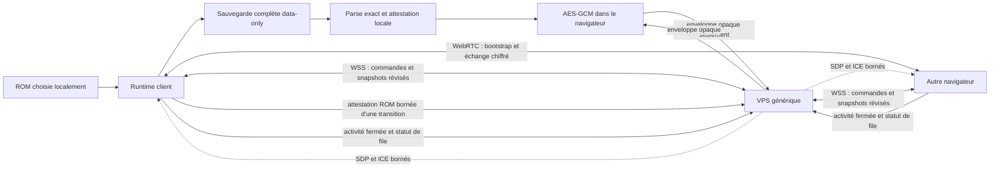

# Frontière des données réseau

## Décision

La ROM et tout contenu résolu depuis celle-ci restent dans le navigateur du
joueur. Le VPS est un service générique : il ne reçoit ni n'interprète aucun
schéma propre à HGSS, asset ou sauvegarde en clair. Il voit nécessairement
l'origine autorisée, l'identité générique, les tailles, révisions et horaires
des requêtes.
Pour la mise en relation, il connaît aussi une activité neutre parmi
`trade | pvp | coop`, un identifiant de match, les deux identités appariées, leur
rôle RTC et l'expiration. Pour une session partagée, il voit aussi une
compatibilité opaque, deux profils de présentation bornés, leurs positions
numériques, séquences et révisions. Ces valeurs sont validées structurellement,
sans ROM ni interprétation du lieu ou de la progression.
Un nouveau système ne peut pas contourner cette règle en envoyant directement
son objet métier.

Cette séparation s'applique à la sauvegarde cloud, aux échanges, à la coop, aux
combats, aux diagnostics et aux futurs modules.

Un éventuel tunnel HTTPS/WSS termine exclusivement sur le service du VPS
(`social-signaling`). Le client statique, y compris lorsqu’il est servi sur
`localhost`, se connecte à l’URL publique de ce serveur et n’a jamais besoin
d’être placé dans un tunnel. Le tunnel de signalisation ne relaie pas le
DataChannel WebRTC et ne remplace donc ni STUN ni TURN.

Les rapports de bug restent des fichiers téléchargés localement dans le build
GitHub Pages. Leur écriture HTTP n'existe qu'en développement vers le plugin
Vite local ; le contrôle d'architecture interdit les API réseau navigateur hors
de `web/src/online/`, à cette unique exception locale explicitement gardée.

## Flux autorisés



L'ordre est obligatoire : normaliser toute la sauvegarde, la revalider,
l'attester, la chiffrer, puis l'envoyer. Le chiffrement ne remplace jamais la
normalisation data-only.

## Ce que le VPS peut connaître

| Autorisé | Interdit |
| --- | --- |
| Identité de compte générique | Binaire, fragment ou empreinte de ROM |
| Identifiant d'objet opaque de 128 bits dérivé par HMAC | Nom de jeu, slot, créature, capacité, objet, personnage ou lieu |
| Taille du bloc chiffré | Texte, image, son, modèle, script ou table extrait de la ROM |
| Révision opaque et ETag | Sauvegarde en clair ou objet runtime non normalisé |
| IV et ciphertext AES-GCM | Contenu d'un échange, d'un combat ou d'une campagne |
| Présence, relation d'amis, SDP et ICE | Message applicatif libre dans la signalisation |
| Activité `trade`, `pvp` ou `coop`, identifiants opaques de match/négociation, pair, rôle et expiration | Offre, inventaire, résultat, score, rang ou contenu de session dans le matchmaking |
| Compatibilité opaque, profil borné, position numérique, séquence et révision d'une session partagée | Asset, texte ROM, inventaire, créature, combat, script ou sauvegarde en clair |

Le serveur accepte uniquement une enveloppe exacte :

```json
{
  "version": 1,
  "algorithm": "A256GCM",
  "iv": "base64url",
  "ciphertext": "base64url"
}
```

Il refuse les champs supplémentaires, les types de contenu différents, les
identifiants d'objet libres, les tailles hors limite et les écritures sans
précondition de révision. Chaque objet est privé et cloisonné par compte. Il
n'existe ni route de partage, ni boîte aux lettres d'échange.

## Sauvegarde complète locale et cloud

La nouvelle émission de `HgssSaveStateV1` est elle-même le document data-only
canonique. Le cloud peut donc conserver la sauvegarde complète, à la manière
d'un fichier Steam Cloud, et non plus une sélection incomplète de champs. Cela
ne signifie jamais qu'un objet runtime est sérialisé directement : chaque
structure persistante possède une projection explicite et les valeurs résolues
depuis la ROM sont supprimées ou remplacées par une référence locale.

`hgssDataOnlySaveAuthority` reparcourt le document avec le parseur exact, produit
une copie JSON canonique, stable et gelée, puis lui associe une preuve locale non
sérialisable. Une copie JSON, un objet forgé, un champ supplémentaire ou le
document d'une autre autorité est refusé avant `fetch`. La même preuve est
exigée par `hgssDataOnlySaveStorage` avant le moindre accès au stockage d'un
nouveau slot ; les primitives génériques restent réservées aux lectures et
migrations legacy. La façade
`hgssFullSaveCloudVault` place ensuite les métadonnées exactes du slot dans
`campaign.slot` et, pour un snapshot présent, l'intégralité du document attesté
dans `campaign.full`, avant AES-GCM et le transport opaque. Une suppression
métier conserve uniquement un tombstone horodaté ; la suppression physique est
réservée au compactage explicite. Les
contrôles de frontière interdisent toujours au gameplay d'importer directement
le codec et le transport bas niveau.

Les anciennes sauvegardes restent lisibles, mais leur migration est une étape
locale explicite : `restoreHgssSaveState` les hydrate avec les catalogues de la
ROM du joueur, puis `createHgssSaveState` recrée le document canonique. Lors de
la lecture du catalogue titre, un ancien payload déjà présent dans un slot ou
dans l'ancienne clé mono-save est remplacé uniquement après cette attestation.
La migration vérifie que les octets inspectés n'ont pas changé, écrit d'abord
le slot canonique, puis retire l'ancienne source. Un claim durable
`prepared -> purging`, attesté une seconde fois avant toute suppression, permet
au redémarrage de terminer ou d’annuler exactement l’opération ; une projection,
une écriture ou une vérification qui échoue laisse les octets concurrents
intacts. La
méthode `project` de l'autorité n'a aucun catalogue et ne prétend donc pas
migrer directement `romGameCode`, des textes résolus ou d'autres champs legacy ;
leurs octets bruts ne reçoivent jamais l'attestation cloud.
Le sas titre sélectionne le mode local ou un cache de campagne cloisonné par URL
canonique du serveur et identité de compte. Ce choix précède toute lecture et
tout affichage du catalogue. Aucun compte ne reçoit automatiquement les octets
du mode local : son cache commence vide. Une migration future devra être
explicitement consentie et sérialisée par une transaction inter-onglets ; elle
ne peut pas reposer sur un pseudo-CAS `localStorage`. Le cache physique reste
sous un bail exclusif Web Locks pendant tout le parcours sas/campagne ; une
portée déjà ouverte échoue avant le catalogue. Le fallback sans Web Locks est
réservé aux WebView mono-document. `pagehide` persiste avant de rendre le bail
et un retour bfcache recommence au titre.

Pour les comptes autorisés au cloud, la réconciliation lit les trois objets et
planifie toutes ses décisions avant la première mutation. Un slot présent d’un
seul côté est copié. Pour les objets modernes, le descendant causal portant la
mutation HLC serveur la plus récente gagne, même si l’horloge murale d’un
appareil recule ; deux branches hors ligne restent un conflit explicite au lieu
d’être départagées par une date mensongère. Le repli legacy sans ancrage causal
compare encore `savedAt`. Un tombstone descendant supprime la copie locale avec
précondition, tandis qu’une sauvegarde réellement nouvelle remplace le
tombstone avec l’ETag attendu. Deux contenus legacy portant exactement le même
horodatage, ou une suppression simultanée, déclenchent un conflit sûr avant
toute action planifiée. Un slot
local ou distant corrompu n’est jamais remplacé automatiquement. « Hors ligne »
ouvre le cache du compte sans arbitrage ; « Cette console » / « Réparer cloud »
et « Version cloud » sont des mutations explicites liées à la fois à l’ETag
distant et au token brut exact du slot local (ainsi qu’au tombstone éventuel).
Toute course multi-onglet ou tout `412` force une relecture puis redemande une
décision. Les
sauvegardes en partie
restent d’abord locales ; leur écriture cloud est sérialisée par slot et une
erreur réseau conserve la copie locale pour la prochaine réconciliation. Un
`412` n’autorise aucune application locale et ne rafraîchit jamais l’ETag sans
réconciliation complète. Une suppression est inscrite avant la mutation des
octets dans un journal local cloisonné par serveur, compte, code ROM, version,
langue et slot. Il contient les empreintes SHA-256 du token exact et de ses
états committed/staging transitionnels. Le mode compte hors ligne l’applique
avant toute migration ou lecture du catalogue. Ce tombstone durable est réémis
après rechargement et n’est retiré qu’une fois remplacé par une sauvegarde
réellement nouvelle ou arbitré explicitement.

L’arbitrage automatique V1 de deux sauvegardes indépendantes compare encore les
horloges murales. Une suppression locale reconnue par son empreinte causale ne
dépend plus de cet ordre. Une révision HLC ou un horodatage serveur reste
nécessaire pour le cas indépendant sans exposer le document chiffré au VPS.

La sauvegarde data-only complète peut conserver :

- les choix, compteurs, RNG, temps, options et progression du joueur ;
- la session fonctionnelle inter-carte de la Frontier (mode, sélection, allié et
  couples d'identifiants numériques nécessaires à la reprise) ;
- les identifiants numériques nécessaires à la progression ;
- les caractéristiques propres à une instance, comme HP, PP, IV, EV, niveau et
  statut ;
- un texte réellement saisi par un joueur, borné et marqué comme tel ;
- une référence locale stable que le client résout après avoir chargé sa ROM ;
- l'état fonctionnel numérique du Safari (arrangements, niveaux et placements
  choisis), sans texte ni ressource de présentation résolue.

Elle exclut ou transforme :

- les buffers d'affichage temporaires ;
- les noms d'espèce et les données de capacité déjà retirés des créatures
  sauvegardées ;
- les noms provenant d'un échange PNJ, les textes et labels résolus localement ;
- les paramètres de présentation d'une photo, remplacés par son identifiant
  local, ainsi que les baselines d'objets de carte et de décors, reconstruits
  depuis la ROM au chargement ;
- la hauteur de terrain et le mouvement de présentation de l'avatar, eux aussi
  reconstruits depuis la carte locale ;
- le code de ROM et toute empreinte permettant d'identifier son fichier ;
- une configuration ou extension JSON inconnue.

Un champ de texte ambigu n'est jamais supposé être libre. Il doit devenir soit
`user-text`, soit une référence locale numérique ; sinon la projection échoue
sans modifier ni supprimer la sauvegarde locale.

Les registres de script sont désormais vidés lors d'une nouvelle sauvegarde :
ils ne représentent pas une progression et pouvaient contenir des textes
résolus depuis la ROM. L'album photo ne copie plus le nom d'espèce quand aucun
surnom n'a été saisi ; l'affichage le résout depuis le catalogue local.

Les identifiants persistants de créatures sont soit des valeurs aléatoires de
128 bits, soit des identifiants de migration dont l'espace de noms et le chemin
doivent correspondre à un emplacement machine HGSS connu. Un ancien identifiant
hexadécimal capable d'encoder une chaîne arbitraire est refusé par la sauvegarde
canonique, les extensions NG+ et l'émission P2P. Le décodeur impose aussi la
cohérence entre l'identité numérique de ROM, le profil et l'état terrain.

Les seeds libres des modules Randomizer, Tous-les-Pokémon et Pokémon visibles
portent la provenance exacte `config-text`. Cette provenance signifie que la
valeur appartient à la configuration du projet et ne vient pas d'un catalogue
ROM ; elle ne change ni la valeur ni le déterminisme des anciennes campagnes.

La migration legacy conserve les textes dont la provenance joueur peut être
établie (profil, surnom saisi, groupe ami ou profil distant), transforme les
libellés locaux d'œuf et d'échange PNJ en références numériques, et met en
quarantaine un nom OT ambigu. Un marqueur fonctionnel `isPlayer` préserve alors
les règles de bonus d'expérience sans réémettre ce texte.

## Contrat des futurs modules

Chaque module qui ajoute un état à la sauvegarde complète fournit explicitement :

1. une clé machine neutre et une version ;
2. un projecteur data-only sans spread d'objet runtime ;
3. un décodeur exact qui refuse les champs, clés et versions inconnus ;
4. une restauration sur brouillon, validée avant publication dans le runtime ;
5. des tests canary garantissant qu'aucun texte, objet ou nombre sentinelle issu
   d'un catalogue ROM n'apparaît dans le JSON canonique.

Une extension inconnue n'est pas attestée et ne peut donc pas partir au cloud.
Un futur module devient synchronisable en rejoignant explicitement l'allowlist
du parseur de sauvegarde, sans modifier le serveur ni créer une route dédiée.

## Matchmaking générique et non classé

Le matchmaking n'est pas une boîte aux lettres. `POST /v1/matchmaking` accepte
exactement `{"activity":"trade"}`, `{"activity":"pvp"}` ou
`{"activity":"coop"}` et exige déjà une connexion WebSocket authentifiée.
`GET /v1/matchmaking` ne renvoie qu'un état exact `idle`, `queued` ou `matched` ;
le client le sonde brièvement par HTTP. `DELETE /v1/matchmaking` annule de façon
idempotente. Aucun message applicatif n'est accepté dans ces routes et aucun
événement de résultat n'est ajouté au WebSocket.

Les files sont brassées par le serveur et bornées à 1 000 recherches ; au plus
500 matches sont actifs. Pour chaque paire, le serveur génère deux identifiants
opaques distincts de 128 bits. `matchId` identifie le rendez-vous ;
`negotiationId` autorise temporairement uniquement la signalisation entre les
deux comptes appariés. Le rôle RTC est déterministe : l'identifiant utilisateur
le plus petit lexicalement est `offerer`, l'autre `answerer`. Cet appariement ne
crée jamais une relation d'ami.

La recherche et l'autorisation expirent, avec des TTL configurables et bornés.
Une annulation, un redémarrage ou la déconnexion de la dernière socket d'un
participant supprime l'état des deux côtés. Le remplacement atomique d'une
ancienne socket par une nouvelle socket du même compte conserve le match. Dès
que l'enregistrement disparaît, son ancien `negotiationId` ne permet plus aucun
signal. Le client conserve donc l'autorisation jusqu'à l'établissement du lien
RTC exact et ne nettoie le rendez-vous qu'après cette étape. Un DataChannel déjà
établi reste pair-à-pair et ne dépend pas du polling HTTP. Une Coop bascule
ensuite sur le WebSocket de session autoritaire ; un échange reste sur ce
DataChannel.

Aucun endpoint de score ou de classement n'existe. Un résultat déclaré par un
client est falsifiable ; deux déclarations concordantes le restent si les deux
clients colludent. Tant qu'il n'existe ni arbitre déterministe générique ni
preuve attestée, afficher un leaderboard serait trompeur. Le hub présente donc
le classement comme indisponible au lieu d'inventer des résultats.

## Échanges, coop et combats

Le contenu des échanges circule dans un WebRTC DataChannel. WebRTC chiffre le
canal entre pairs ; la signalisation VPS ne relaie que des offres, réponses et
candidats ICE strictement validés. Chaque
signal exige soit une relation d'ami active, soit l'autorisation éphémère du
match exact `{pair, negotiationId}`. Une
raison libre de déconnexion, un inventaire, une créature ou un snapshot sont
refusés dans la signalisation. Chaque `requestId` accepté est conservé dans une
fenêtre anti-rejeu bornée côté VPS, y compris après reconnexion WebSocket : une
seconde utilisation est refusée sans retransmettre le signal.

L’échange livré utilise un canal logique `trade` à l’intérieur d’un unique
DataChannel attesté. Les deux pairs négocient un identifiant opaque commun,
échangent des snapshots fonctionnels stricts et acceptent exactement la même
paire de révisions. Changer ou retirer une offre révoque les deux acceptations.
Les noms d’espèce, d’objet et de capacité ainsi que les sprites sont toujours
résolus depuis la ROM locale pour la preview ; ils ne figurent pas dans les
trames. Seuls les nombres fonctionnels et les textes dont la provenance joueur
est attestée peuvent traverser directement le canal P2P.

La Coop utilise ensuite un canal WSS dédié, authentifié par ticket à usage
unique. Le serveur ne reçoit que des commandes de marche/course exactes et des
snapshots génériques à deux membres. Il vérifie identité, origine, pas cardinal,
séquence, révision, occupation et idempotence. Une arrivée inter-carte est mise
en attente et envoyée exclusivement au propriétaire attaché ; celui-ci la
recalcule depuis sa ROM locale et ne peut accepter qu'une arrivée exactement
identique. Timeout, absence, divergence ou rejet laissent le snapshot inchangé.

Le commit remplace le même emplacement équipe/PC sur un clone, vérifie les veto
NG+ `player-trade` puis `evolution`, applique localement Pokédex, statistiques,
capacités et évolution d’échange, écrit la sauvegarde data-only, puis seulement
publie le clone dans le runtime. Un reçu borné rend les duplicatas idempotents.
Avant d’annoncer `prepared`, chaque client persiste aussi un journal local V1
borné contenant la paire exacte, les deux snapshots fonctionnels, les
participants et la destination — jamais les libellés ou assets de la ROM. Si le
canal tombe entre les deux écritures, une nouvelle session RTC compare ces
journaux, termine le commit exactement une fois puis les supprime après preuve
du commit distant. Une preuve distante sans journal préparé ni reçu local est
refusée sans mutation. Aucun de ces messages applicatifs n’atteint le VPS.

Cette garantie décrit le client officiel. Un client volontairement modifié peut
tenter de dissimuler des octets dans des champs SDP/ICE que le serveur doit
relayer pour établir WebRTC ; aucune validation sémantique ne peut exclure tout
canal caché sans casser l'interopérabilité. Les identifiants officiels sont donc
générés de façon opaque, les formes et tailles sont bornées, et le serveur ne
persiste ni ne journalise SDP ou ICE.

Chaque navigateur charge sa propre ROM compatible et résout localement les
identifiants reçus. Aucun asset, texte ou table n'est transféré pour compenser
une ROM absente. Un échange est validé puis engagé par les deux pairs avec le
protocole transactionnel ; il n’utilise jamais le coffre cloud comme boîte aux
lettres.

## Clés et perte de données

- Pour les nouveaux comptes, le serveur émet un `vaultKeyId` aléatoire de
  256 bits, immuable et non secret. La clé AES-GCM est dérivée dans le navigateur
  du mot de passe, de cet identifiant et de l’identité du compte par
  PBKDF2-SHA-256 avec 600 000 itérations. Un changement de domaine, de port,
  d’adresse LAN ou d’appareil ne change donc plus la clé du coffre.
- Un compte créé par un serveur antérieur, sans `vaultKeyId`, conserve la
  dérivation V1 liée à l’URL jusqu’à une migration explicite depuis une copie
  déverrouillée. Le serveur ne bascule jamais silencieusement un ancien coffre
  vers une clé qui ne pourrait pas lire ses objets existants.
- Le mot de passe n’est jamais persisté. Le trousseau peut conserver uniquement
  la clé dérivée exportée, sous une clé de stockage issue d’un hash du contexte ;
  ni le mot de passe ni le couple serveur/compte ne figurent en clair dans le nom
  de cette entrée. Cette clé exportée reste un secret local sensible.
- Le VPS reçoit le mot de passe uniquement comme credential de son
  authentification HTTPS, puis n’en conserve que l’empreinte scrypt. La clé
  dérivée et les résultats cryptographiques du trousseau ne lui sont jamais
  transmis.
- Chaque chiffrement exige un contexte authentifié canonique qui lie la version
  du protocole, l'identité générique et l'identifiant opaque de l'objet. Ce
  contexte reste local et empêche de substituer une enveloppe entre deux comptes
  ou deux objets utilisant la même clé.
- Elle ne doit figurer ni dans Git, ni dans le bundle Pages, ni dans les logs,
  ni dans une variable du VPS.
- La même combinaison mot de passe/`vaultKeyId`/compte redérive la même clé sur
  toutes les origines et tous les appareils. Si le mot de passe disparaît et que
  la copie locale de la clé n’est plus disponible,
  les objets existants sont irrécupérables ; les seules données persistées par
  le VPS conforme ne permettent ni de les déchiffrer ni de reconstruire la clé.
- Cette dérivation n’est pas une preuve « zero knowledge » contre un serveur
  d’authentification compromis au moment de la connexion : celui-ci voit
  transitoirement le mot de passe et pourrait reproduire la KDF. Elle protège le
  coffre contre les données effectivement conservées par le service, pas contre
  un endpoint de connexion devenu malveillant.
- L'identifiant d’objet est constitué des 128 premiers bits d’un HMAC-SHA-256
  versionné liant la clé, l’identité ROM locale et le slot. Il est stable pour
  ce contexte mais ne contient aucun nom de slot ou de jeu lisible par le VPS.

## Tests obligatoires

- `npm run check:repository`, exécuté avant le build client, inspecte tout fichier
  suivi ou ajoutable par Git. Une ROM locale correctement ignorée reste
  utilisable, mais son ajout forcé est bloqué par le chemin et par la détection
  d'un en-tête NDS, même sous une extension neutre ; sauvegardes, extractions,
  archives, rapports locaux et clés privées sont également refusés.
- Le projet serveur interdit les imports client, le vocabulaire métier et les
  binaires, sauvegardes, archives ou clés privées.
- Le codec refuse Blob, File, ArrayBuffer, DataView, TypedArray, classes,
  accesseurs, cycles, nombres non finis et JSON hors limites.
- Une batterie remplace successivement chaque feuille numérique ou booléenne
  d'une sauvegarde canonique par une chaîne et exige le rejet de chacune.
- Les doublons d'identité ROM/profil/terrain, les identifiants machine et les
  états Frontier sont soumis à des tests de cohérence et de round-trip.
- Les requêtes HTTP ne peuvent contenir que l'enveloppe opaque exacte.
- Les snapshots de matchmaking refusent activité inconnue, champ supplémentaire,
  identifiant non opaque, rôle ou horodatage invalide ; une mauvaise paire ou
  un ancien `negotiationId` ne peut pas signaler entre inconnus.
- Aucun score, résultat ou rang envoyé par le client ne possède de route serveur.
- Une valeur canary placée dans un catalogue, un buffer, une photo ou une
  propriété runtime inconnue ne doit jamais apparaître dans la sauvegarde
  canonique ni dans une requête.
- Une clé d'extension inconnue, une mauvaise version ou un champ supplémentaire
  échoue avant l'hydratation.
- Une erreur distante ne réécrit et ne supprime jamais le slot navigateur.
- Une migration locale échouée ou concurrente conserve exactement le slot ou
  la clé legacy d'origine et ne crée aucun payload brut dans un nouveau slot.
- L’échange utilise le DataChannel ; la Coop n’y conserve que son bootstrap,
  puis utilise la route WSS autoritaire stricte. Aucun contenu applicatif libre
  ne doit apparaître dans la signalisation ou les routes de matchmaking.

## Portée juridique

Cette architecture réduit l'exposition et rend la frontière vérifiable, mais
elle ne constitue pas un avis juridique. En droit de l'Union européenne, la
protection du logiciel vise l'expression du programme et non les idées ou
principes sous-jacents ; la Cour de justice a aussi distingué fonctionnalité,
langage et formats de fichiers de l'expression protégée par le droit d'auteur
sur le programme. L'arrêt précise toutefois qu'un langage ou un format peut
encore bénéficier du droit d'auteur comme œuvre s'il constitue une création
intellectuelle originale. Des droits distincts peuvent aussi protéger une base
de données et l'extraction ou la réutilisation d'une partie substantielle de son
contenu.

Par conséquent, « ce ne sont que des données » n'est pas une garantie. Le fait
de chiffrer une copie ne la rend pas automatiquement licite : la projection
doit d'abord exclure les ressources, textes, tables et autres expressions
protégées. Avant une publication publique, le périmètre doit être revu par un
professionnel compétent pour les juridictions et usages visés.

Les marqueurs `user-text` et `config-text` sont des invariants vérifiables du
client officiel, pas une preuve cryptographique de l'auteur d'une chaîne. Un
client volontairement modifié peut mentir sur cette provenance ; interdire
toute chaîne expressive rendrait aussi impossibles noms, surnoms et seeds
libres. La garantie technique porte donc sur la projection et les chemins
officiels de création, avec des longueurs et schémas bornés.

Sources officielles : [directive 2009/24/CE sur les programmes d'ordinateur](https://eur-lex.europa.eu/legal-content/FR/TXT/?uri=CELEX:32009L0024),
[directive 96/9/CE sur les bases de données](https://eur-lex.europa.eu/legal-content/FR/TXT/?uri=CELEX:31996L0009),
[CJUE, C-406/10, SAS Institute](https://infocuria.curia.europa.eu/tabs/redirect/juris/liste.jsf?language=fr&num=C-406%2F10).
