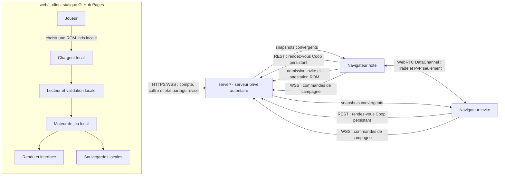

> Publication alpha : voir [PUBLICATION.md](PUBLICATION.md). Le workflow Pages actuel publie le client solo sans backend ni signature Ed25519 obligatoire. Les anciennes procédures de release ci-dessous décrivent une cible plus complète.

# Échos d’Or & d’Argent — Alpha

Projet fan non officiel autour de HGSS, en alpha. Compatibilité actuelle :
HeartGold FR, à partir du fichier local de l’utilisateur. Aucun jeu fourni.

## Vision

PokeMaster est une application web TypeScript utilisant Three.js qui reconstruit le contenu et le fonctionnement de Pokemon Or HeartGold (FR) dans un runtime web moderne. Le joueur fournit sa propre ROM localement ; PokeMaster en lit les donnees utiles, comme les images, sons, textes, cartes et donnees de jeu, puis notre code TypeScript les interprete pour rejouer HeartGold dans le navigateur.

Le projet ne distribue aucune ROM, aucun BIOS Nintendo DS et aucune ressource protegee. La ROM reste un fichier local choisi explicitement par le joueur et ne doit jamais etre envoyee vers un serveur du projet.

Le projet n'est pas un emulateur Nintendo DS. Il ne reproduit ni le materiel DS, ni son processeur, ni ses deux ecrans. Il exploite les donnees de cette edition precise pour reconstruire fidelement le jeu, tout en modernisant volontairement la presentation, l'ergonomie et les interactions. La premiere correction est la disparition de la dependance quotidienne a l'ecran tactile.

## Probleme principal a resoudre

Pokemon Or HeartGold utilise deux ecrans :

- l'ecran superieur pour le jeu principal ;
- l'ecran inferieur, tactile, pour les menus, raccourcis, Pokegear, sac, carte et certaines actions contextuelles.

Sur un navigateur de bureau ou sur mobile, reproduire deux ecrans fixes et une saisie tactile emulee est peu naturel. PokeMaster doit donc rendre les commandes de l'ecran inferieur accessibles depuis une interface unique et moderne.

## Experience cible

1. Le joueur ouvre l'application web.
2. Il choisit sa ROM `.nds` depuis son ordinateur ou son appareil.
3. L'application valide localement que le fichier est une ROM compatible.
4. Apres l'ecran titre, il restaure ou ouvre son compte, ou choisit explicitement le mode local.
5. Le catalogue de sauvegardes s'ouvre seulement apres ce sas, puis le jeu demarre dans une vue principale adaptee au navigateur.
6. Les anciennes fonctions tactiles sont exposees dans un menu normal, accessible a la souris, au clavier, a la manette et au tactile.
7. Les sauvegardes fonctionnent d'abord localement et peuvent etre
   exportees/importees ; une copie cloud optionnelle est chiffrée côté client.

## Clarification du perimetre

Le projet vise la fidelite des donnees et du gameplay, pas une reproduction pixel-perfect de l'interface Nintendo DS.

| Domaine | Exigence |
| --- | --- |
| Donnees et gameplay | Doivent venir de la ROM quand les donnees existent : maps, positions, collisions, scripts, dialogues, Pokemon, statistiques, objets, rencontres, equipes, trainers, musiques, modeles, textures, animations, progression et regles. |
| Presentation et interaction | Peuvent etre modernisees : affichage sur un seul ecran, disposition des menus, HUD, resolution, controles clavier/manette/tactile et certaines transitions. |

- Le second ecran DS et ses controles tactiles ne sont pas une cible a reproduire a l'identique.
- Le moteur doit rester generique et pilote par la ROM : ajouter une carte, une route ou un script ne doit pas signifier ecrire un cas special JavaScript pour cette scene.
- Les identifiants de carte, warps, connexions, evenements de coordonnees, scripts, PNJ et ressources associees doivent etre traites comme des donnees ROM, pas comme des listes fermees dans le code TypeScript.
- Pour une ROM supportee, une ressource attendue doit etre trouvee et interpretee correctement ; sinon le moteur doit signaler l'etat non pris en charge au lieu d'inventer un remplacement arbitraire.
- La validation de ROM doit rester pragmatique : PokeMaster vise un perimetre supporte et reproductible, pas la reparation universelle de ROM modifiees ou corrompues.

## Principe de conception

PokeMaster est organise en cinq niveaux independants :

- un lecteur de ROM decode localement les formats de fichiers et archives de HeartGold ;
- un catalogue de donnees normalise represente les ressources et les donnees de jeu extraites ;
- des systemes de jeu generiques, entierement distincts du code de la ROM, interpretent cartes, connexions, warps, collisions, evenements, scripts, PNJ, dialogues, inventaire, equipe, combats, sauvegardes, musique et effets ;
- une couche d'interface moderne remplace les interactions prevues pour l'ecran inferieur ;
- Three.js sert au rendu WebGL, aux scenes, a la camera, aux transitions et aux elements 3D lorsque cela apporte une valeur reelle.

Cette separation est essentielle : la ROM apporte les donnees localement au joueur, tandis que PokeMaster possede tout le code qui les interprete et les affiche. Aucun code DS n'est execute. Le depot ne contient pas les ressources extraites, et l'application ne doit ni les envoyer vers un serveur ni les rendre accessibles a un autre utilisateur.

Ajouter Bourg Geon, la route suivante ou un nouveau script ne doit donc pas signifier coder cette carte, cette route ou ce script. Le travail attendu est d'implementer les formats, commandes et comportements generiques necessaires, puis de laisser les donnees de la ROM determiner ce qui se passe.

## Remplacement de l'ecran tactile

### Menu principal moderne

Un bouton ou une touche dediee ouvre un panneau de menu superpose au jeu. Il remplace les acces habituels de l'ecran inferieur :

- equipe Pokemon ;
- sac ;
- Pokegear ;
- carte ;
- sauvegarde ;
- options ;
- commandes et raccourcis configurables.

Le panneau doit etre navigable au clavier et a la manette sans exiger de pointeur. Sur mobile, il doit rester utilisable au pouce, sans afficher une seconde ecran DS miniature permanente.

### Actions contextuelles

Les donnees et flux de HeartGold comprennent des interactions concues pour l'ecran tactile. Le runtime web doit les traduire selon leur nature :

| Cas | Comportement cible |
| --- | --- |
| Menu standard | Commande dans le panneau moderne |
| Bouton ponctuel | Bouton contextuel ou action mappee a une touche |
| Interface de dessin ou minijeu tactile | Mode tactile web temporaire, clairement isole |
| Interaction impossible a traduire sans ambigute | Vue web dediee avec pointeur simule |

Le repli vers une vue tactile web est acceptable pour les cas rares, mais il ne doit pas etre le parcours normal pour le sac, la carte, le Pokegear ou la gestion d'equipe.

## Architecture cible



## Deux projets autonomes

Le depot contient deux projets deployables separement :

| Projet | Hebergement cible | Responsabilite |
| --- | --- | --- |
| `web/` | GitHub Pages | Client statique, lecture locale de la ROM, moteur, rendu, sauvegardes, attestation ROM et transports multijoueur. |
| `server/` | VPS Hostinger derriere HTTPS/WSS | Comptes, amis, presence, rendez-vous Coop persistants, matchmaking et signalisation WebRTC pour Trade/PvP, coffre opaque et sessions partagees autoritaires. |

Le serveur prive est l'autorite des sessions partagees : les deux clients s'y
attachent en WSS et convergent sur ses revisions, positions et sequences. Il
persiste les salles, les acquittements et une tete de continuite par branche :
apres fermeture, expiration ou redemarrage, le meme compte proprietaire peut
reprendre uniquement la revision et l'empreinte exactes, tandis qu'une seconde
salle, une copie en retard ou une branche divergente est refusee. Le service
reste volontairement generique et ne recoit ni ROM, ni sauvegarde en clair, ni
commande de combat ou contenu de script. Une transition de carte ou une
interaction scenario partagee est suspendue jusqu'a ce que le proprietaire de
session la reproduise et l'atteste avec sa ROM locale ; sans cette preuve, le
serveur refuse la mutation. L'arrivee de l'invite est elle aussi suspendue tant
que l'hote ne l'a pas validee avec le contexte de sa ROM. Le coffre conserve
uniquement une enveloppe AES-GCM privee et opaque contenant la sauvegarde
data-only complete. La Coop passe directement du rendez-vous REST persistant a
la session WSS autoritaire, sans WebRTC ni DataChannel. WebRTC reste reserve a
Trade, au PvP et a la compatibilite de migration ; le navigateur hote n'est
plus la source de verite des deplacements Coop.

Le contrat complet, y compris les champs interdits et les obligations imposees
aux futurs modules, est defini dans
[`FRONTIERE_DONNEES_RESEAU.md`](FRONTIERE_DONNEES_RESEAU.md).

Cette architecture est maintenant la decision de reference. Apres l'ecran
titre, un sas « Dossier Dresseur » restaure la session, propose la connexion ou
la creation de compte, ou laisse choisir explicitement le mode local. Le
catalogue de sauvegardes n'est lu et affiche qu'apres cette etape. L'acces
« Multijoueur » reste ensuite dans le menu burger, au meme niveau que
« Pokematos », et reutilise la session deja etablie sans formulaire de compte en
partie. Le hub expose les raccourcis `Classement`, `PvP`, `Coop` et
`Echange`, puis le choix d'un ami en ligne ou d'un joueur aleatoire. Chaque ami
en ligne possede directement les actions `PvP`, `Coop` et `Echange`, en plus
des actions sociales distinctes : ajouter,
accepter, refuser, annuler une demande sortante et retirer un ami. Le classement
reste volontairement desactive : le serveur ne possede encore aucun resultat
atteste et n'accepte pas de score arbitraire du client.

La connexion, la liste d'amis, les invitations et les echanges P2P sont
branches a l'UI et a `main.ts`. Les echanges conservent un journal local
data-only et reprennent une coupure inter-commit exactement une fois lors de la
reconnexion au meme pair. Trade et PvP utilisent le matchmaking HTTP borne,
l'autorisation ephemere de signalisation puis leur lien RTC exact. La Coop
utilise un rendez-vous REST distinct, persistant et idempotent, pour un ami ou
un joueur aleatoire ; le serveur attribue le role et l'identifiant opaque de la
session avant l'attachement WSS direct. Un accord d'intention type protege aussi
chaque protocole applicatif. L'etat d'integration exact est detaille dans
[`ARCHITECTURE_EXTENSIBLE_NG_PLUS_MULTIJOUER.md`](ARCHITECTURE_EXTENSIBLE_NG_PLUS_MULTIJOUER.md).
L'echange utilise deja ce lien de bout en bout. L'entree en campagne
cooperative, la presence, la marche/course, les transitions de carte et une
premiere tranche sure d'interactions scenario utilisent maintenant l'autorite
serveur. Les flags et variables persistantes produits par ces scripts sont
checkpointes et acquittes avant leur presentation immersive. Les evenements de
coordonnee combines a un pas et les combats partages restent des tranches
distinctes a raccorder.
La synchronisation des trois slots cloud, elle, est
integree au sas titre avant l'affichage du catalogue : stockage local cloisonne
par serveur et compte, cle derivee du mot de passe, objets opaques, tombstones et
arbitrage causal par HLC serveur avec choix explicite en cas de divergence. « Hors
ligne » garde le cache du compte sans mutation ; « Cette console », « Reparer
cloud » et « Version cloud » ne modifient un cote que si l'ETag distant et le
token local presentes n'ont pas change. Les suppressions sont journalisees avant
les octets, avec empreintes causales des transitions committed/staging, afin
qu'une coupure ou une migration legacy interrompue ne restaure pas une ancienne
copie. Un bail exclusif couvre tout le parcours sas/campagne et est libere apres
persistance sur `pagehide`; un autre onglet echoue immediatement sans lire le
catalogue. Lors de la premiere ouverture d'un compte qui peut recevoir une
sauvegarde locale plus recente, le sas demande explicitement « Importer » ou
« Garder separee ». L'import est lie au serveur, au compte et a l'identite ROM,
verifie les versions observees avant chaque ecriture et ne supprime jamais la
source locale. Ensuite, pour chaque slot, l'ETag et la mutation logique du VPS
sont lies a l'empreinte du token local : un seul cote modifie converge
automatiquement entre appareils, tandis que deux branches hors ligne restent un
conflit explicite. `savedAt` demeure la date affichee mais ne peut plus faire
gagner une horloge d'appareil fausse.

La frontiere legale cote reseau est stricte : toute interpretation specifique au
jeu reste dans le client, tandis que `server/` demeure generique et ne doit
importer aucun module de `web/`. Le binaire ROM, les sauvegardes, les ressources
extraites et les rapports bruts restent locaux et hors des livrables. Le code
JavaScript original du client, lui, devient necessairement public lorsqu'il est
envoye par GitHub Pages ; la minification ne peut pas le rendre secret.

### Technologies envisagees

- TypeScript pour l'application et les contrats entre modules.
- Three.js pour le rendu WebGL, les transitions et les composants 3D utiles.
- Un lecteur de ROM HeartGold, ecrit par le projet. Il ouvre la structure du fichier `.nds`, localise le systeme de fichiers interne puis decode les formats necessaires aux images, sons, textes, cartes, scripts et tables de jeu. Il ne lance aucun code de la ROM.
- Un moteur de jeu TypeScript pour interpreter ces donnees dans le navigateur. Sa conception privilegie des modules testables, des donnees normalisees et des comportements de jeu explicitement documentes.
- Web Audio pour le son, avec reprise apres une action explicite du joueur selon les regles des navigateurs.
- IndexedDB pour stocker les sauvegardes et les parametres localement.
- File System Access API lorsque disponible, avec un fallback par import/export de fichiers de sauvegarde.
- HTTPS/WSS vers le serveur prive pour le rendez-vous persistant et les commandes/snapshots autoritaires de la Coop ; WebRTC DataChannel reste reserve a Trade, au PvP et a la compatibilite de migration.
- Un petit service Node.js generique sur VPS pour l'identite, les amis, la presence, les rendez-vous Coop, le matchmaking et la signalisation WebRTC de Trade/PvP, les sessions partagees et des objets chiffres prives qu'il ne peut pas interpreter.

Three.js ne remplace ni le lecteur de donnees ni le moteur de jeu. Il est la couche de presentation WebGL autour du runtime web.

## Environnement recommande

Le client dans `web/` cible explicitement un environnement Node moderne compatible avec Vite 8, Vitest 4 et ESLint 10. Le serveur autonome dans `server/` exige Node.js 20.11 ou plus recent, ou Docker.

- Node `22.13.0+` recommande pour le developpement courant.
- Node `20.19.0+` reste accepte si vous devez rester sur la branche 20.x.
- npm `10.8.0+` recommande.

La racine et chacun des deux projets publient leurs propres reperes `.nvmrc` et `.node-version`, afin que `web/` et `server/` restent copiables et deployables independamment. Le projet web expose aussi `npm run check:env` et bloque `npm install` via `preinstall` si la version Node est hors contrat.

Sequence conseillee apres un changement de version Node :

```powershell
Set-Location web
Remove-Item node_modules -Recurse -Force
npm.cmd install
npm.cmd run check:env
npm.cmd run build
```

Si un message de bindings `rolldown` manquants persiste apres la mise a jour Node/npm, supprimez aussi `package-lock.json` puis relancez `npm.cmd install`.

## Serveur prive jouable sur le reseau local

Avant la publication, la topologie de reference se lance depuis `web/` avec
`npm run dev:lan`. Elle conserve le client principal sur
`http://localhost:5173`, expose un second client HTTPS a tous les appareils du
LAN et demarre le vrai service persistant de comptes, amis, matchmaking,
WebSocket, rendez-vous Coop et coffre cloud. Ce service est deja le vrai serveur
prive jouable du reseau : les appareils du LAN le joignent directement, sans
tunnel. Le tunnel ne devient utile que pour exposer ce meme serveur au public.
Les deux clients emploient la meme autorite serveur
canonique, donc un compte retrouve la version la plus recente de sa campagne
d'un appareil a l'autre.

Sur macOS, le gestionnaire `npm run lan:service:install` puis
`npm run lan:service:start` rend cette pile supervisée disponible à chaque
ouverture de session après redémarrage. Il conserve le backend en boucle locale,
surveille les contrats HTTP exacts et relance l’ensemble après une panne durable.
L’installation, l’état, l’arrêt et la désinstallation sûre sont détaillés dans
[`LAN_DEVELOPMENT.md`](LAN_DEVELOPMENT.md).

La premiere utilisation exige d'installer la CA publique locale sur chaque
appareil ; ses cles privees restent uniquement sur la machine serveur. Les URL
exactes, le certificat public et la procedure sont decrits dans
[`LAN_DEVELOPMENT.md`](LAN_DEVELOPMENT.md).

## Evolution vers un jeu moddable

La lecture de donnees est le point de depart, pas la destination. Une fois les formats et les comportements suffisamment compris, PokeMaster doit pouvoir choisir, systeme par systeme, entre :

- interpreter les donnees HeartGold d'origine dans notre runtime ;
- appliquer un mod explicite et reversible aux donnees chargees localement ;
- remplacer ou etendre un systeme par un module PokeMaster librement modifiable ;
- lancer a terme une campagne construite avec des donnees et ressources propres au projet.

Le moteur PokeMaster doit definir des formats de donnees documentes pour les creatures, capacites, objets, cartes, PNJ, combats, quetes et scripts. Les modules ne doivent pas dependre directement d'adresses memoire specifiques a HeartGold. Cette regle est ce qui rendra les correctifs, les campagnes originales et les crossovers techniquement possibles.

Un crossover ne doit utiliser des personnages, cartes, musiques, illustrations ou marques externes que si le projet dispose des droits necessaires. Sans ces droits, il doit etre realise avec du contenu original ou sous licence compatible.

## Etat actuel et structure active

Le projet a depasse le jalon d'ouverture : le monde, les scripts de terrain, les sauvegardes, les menus, les Pokemon et les combats possedent maintenant leurs propres modules. Une fonction presente dans le runtime n'est toutefois consideree comme terminee que si son parcours ROM reel est couvert par un test ou un audit reproductible.

Le verdict de finition, les preuves disponibles et les bloqueurs ordonnés sont
tenus dans [`AUDIT_PROJET_100_PERCENT.md`](AUDIT_PROJET_100_PERCENT.md).
Le classement des fichiers locaux, les exclusions et les lots de commits sûrs
sont détaillés dans [`PLAN_REPRODUCTIBILITE_GIT.md`](PLAN_REPRODUCTIBILITE_GIT.md).

La racine separe desormais clairement les deux produits :

| Repertoire | Produit |
| --- | --- |
| `web/` | Client statique et tout le runtime de jeu local. |
| `server/` | Serveur prive generique de comptes, rendez-vous et sessions autoritaires, deployable independamment sur le VPS. |

Chaque projet possede son propre `package.json`, ses dependances, sa compilation et ses tests. Le workflow manuel [`.github/workflows/deploy-client-pages.yml`](.github/workflows/deploy-client-pages.yml) ne publie que `web/dist` signe sur GitHub Pages. Le workflow manuel distinct [`.github/workflows/publish-server-image.yml`](.github/workflows/publish-server-image.yml) construit avec le seul contexte `server/`, publie l'image dans GHCR et ne deploie rien automatiquement sur le VPS. Aucun des deux ne se lance lors d'un simple push sur `main`.

Les responsabilites principales du sous-projet `web/src/` sont les suivantes :

| Repertoire | Responsabilite |
| --- | --- |
| `rom/` | Decodage des formats et catalogues provenant de la ROM. |
| `game/` | Regles et etat du jeu, regroupes par domaine (`world`, `scripts`, `battle`, `pokemon`, `items`, `save`, etc.). |
| `rendering/` | Projection et rendu canvas/Three.js, sans decisions de progression. |
| `audio/` | Lecture des ressources et orchestration audio de la ROM. |
| `styles/` | Point d'entree CSS et feuilles ordonnees par responsabilite visuelle. |
| Fichiers racine de `src/` | Composition de l'application et adaptateurs entre les systemes. Ils ne doivent pas devenir une seconde implementation des domaines ci-dessus. |

`main.ts` reste le point de composition historique et doit maigrir progressivement. Toute nouvelle regle metier doit etre placee dans son domaine sous `game/`; `main.ts` ne doit conserver que le branchement des entrees, des sorties et des vues.

## Contrat pour la phase UI

- L'UI consomme l'etat et les commandes des systemes de jeu ; elle ne modifie pas directement les drapeaux, variables, collisions ou donnees ROM.
- Un composant visuel a un proprietaire CSS identifiable. Les nouvelles regles rejoignent `styles/foundation.css`, `application.css`, `battle.css` ou `menus.css`; `refinements.css` ne sert qu'a stabiliser les compositions historiques avant leur migration.
- Une correction de gameplay doit rester generique et couverte par un test du systeme concerne, pas par un identifiant de carte ajoute dans l'interface.
- Clavier, manette, tactile et accessibilite utilisent les memes actions logiques de `gameInput.ts`.
- Les exports de diagnostic dans `REPPORT/` sont des artefacts locaux ignores par Git, jamais des documents de reference du projet.

## Validation avant integration

Depuis `web/`, les changements doivent au minimum passer `npm run lint`, `npm run test` et `npm run build`. Avant une release, `npm run check:reproducibility` doit en plus être exécuté depuis un checkout propre ; il refuse tout changement local et verifie une liste d'ancres suivies du client, du serveur, de la documentation de release et de la CI. Ce controle de fermeture Git n'est pas un inventaire exhaustif du produit : lint, tests, builds et audits restent obligatoires. Les audits qui exigent une ROM locale restent separes et doivent etre executes lorsqu'une modification touche le decodage, les scripts ou la progression du monde.

Depuis `server/`, executer separement `npm run typecheck`, `npm test` et `npm run build`. Le test de frontiere empeche les sources serveur d'importer le client, refuse les binaires ROM/sauvegarde, medias, patchs binaires, archives et cles privees, puis verrouille les seules entrees locales que le Dockerfile peut copier. Les patchs de code source `.patch`/`.diff` restent autorises. Le [`compose.yaml`](server/compose.yaml) construit localement ; sur Hostinger, [`compose.vps.yaml`](server/compose.vps.yaml) tire uniquement l'image GHCR et evite de cloner le client. HTTPS/WSS peut etre expose par reverse proxy ou par l'overlay [`compose.tunnel.yaml`](server/compose.tunnel.yaml), qui tunnelise uniquement le serveur ; un client sur localhost pointe directement vers son URL publique sans tunnel propre. Le guide [serveur social et de signalisation](server/README.md) detaille ces topologies. Le workflow Pages exige la variable publique `POKEMASTER_PUBLIC_ONLINE_SERVER_URL` et les deux secrets base64 de cles Ed25519 documentes dans [`web/BUILD_SECURITY.md`](web/BUILD_SECURITY.md) ; aucun mot de passe, secret de session ou secret Patreon ne doit jamais etre integre au bundle.

Le banc navigateur jetable se lance avec `npm run test:live`. Il rejoue des fichiers `.txt` via les entrees reelles du jeu ; syntaxe, garde-fous et batteries fournies sont documentes dans [`web/debug-tests/README.md`](web/debug-tests/README.md).

Le build de production est durci automatiquement : code et CSS minifies, identifiants manges, noms d'artefacts neutres et hashes, source maps interdites, CSP, SRI et manifeste SHA-384. `npm run verify:build` permet de controler de nouveau le contenu de `dist/` avant publication. La signature Ed25519 est optionnelle ; le workflow Pages alpha publie le client solo sans secret de signature ; sa configuration et les limites propres a une application web sont documentees dans [`web/BUILD_SECURITY.md`](web/BUILD_SECURITY.md).

## Risques a traiter tot

- Les formats internes de HeartGold et les scripts de jeu sont complexes ; le lecteur doit echouer clairement sur un format inconnu plutot que produire des donnees incorrectes.
- La reconstruction des comportements doit etre testee contre des parcours de reference ; la lecture des donnees ne donne pas automatiquement la logique du jeu original.
- Les substitutions arbitraires de ressources masquent les defauts du moteur ; une ROM supportee doit produire la bonne ressource ou une erreur explicite.
- La ROM fournie dans le dossier de travail doit etre exclue de Git et ne doit pas etre republiee.
- Le service VPS doit rester generique : y ajouter une regle, une donnee en clair ou un import propre au jeu briserait la frontiere de deploiement et de conformite.
- Sans relais TURN, certains pairs places derriere des NAT stricts ne pourront pas etablir un lien direct Trade/PvP. La Coop n'est pas concernee : elle utilise REST/WSS vers le serveur prive. Une admission ou une transition ROM reste toutefois impossible pendant l'absence du proprietaire de la session.
- Les stockages fichier, dont le rendez-vous Coop persistant, et les files RTC de matchmaking en memoire visent une petite communaute et une seule instance serveur ; un deploiement multi-instance exigera une base et une coordination partagees.
- Le statut du matchmaking est sonde par HTTP pendant la recherche ; il n'existe ni evenement WebSocket de resultat, ni classement tant qu'un resultat verifiable n'est pas defini.
- Un systeme de validation exhaustif pour toutes les ROMs n'est pas un objectif produit ; le perimetre supporte doit rester simple et verifiable.
- La retro-ingenierie, les ROMs, les patches et la distribution de contenu inspire de Pokemon ont des implications legales qui doivent etre verifiees avant toute publication.

## Ressources hors depot

Le depot distribue le moteur, l'interface et un service social generique, pas la
ROM ni ses ressources extraites. Les nouvelles captures, rapports de probes et
images de reference de developpement qui ne sont pas des dependances du runtime
ne doivent pas etre suivis par Git. Treize references visuelles historiques sont
encore suivies et exigent une decision explicite de provenance/conservation ou
de retrait avant publication. Les anciens rapports generes ont ete desindexes
tout en restant locaux et ignores. S'ils ont deja ete pousses, leur retrait de
l'historique demande une operation `git filter-repo` coordonnee, qui n'est pas
effectuee automatiquement.

Quelques tables TypeScript historiques sont encore commentees comme provenant
directement de la ROM. Une politique juridique exigeant « aucune donnee derivee
dans Git » impose de les migrer vers le decodage runtime ou un module prive
local avant publication. Elles ne vont jamais sur le VPS, mais cette migration
reste distincte de la separation serveur/client et ne doit pas etre masquee.

## Decision actuelle

Le projet ne construit pas un emulateur DS. Il construit un lecteur local des donnees de Pokemon Or HeartGold FR et un runtime web original qui les utilise. La ROM reste sur l'appareil du joueur et ne doit pas devenir une dependance distribuee par le projet. La fidelite attendue porte d'abord sur les donnees et les regles de jeu, tandis que l'interface et les controles peuvent etre modernises. Les futures modifications, campagnes et crossovers reposent sur des modules PokeMaster, avec du contenu original ou autorise lorsque les donnees HeartGold ne suffisent plus.

Pour le multijoueur, le VPS est le vrai serveur prive du reseau : en plus des
comptes, amis, presence et rendez-vous, il possede l'etat revise des sessions
partagees et arbitre chaque deplacement des deux clients. La ROM et le moteur
restent locaux ; les changements de carte passent par une attestation ROM
bornee de l'hote avant mutation serveur, comme l'admission de la position
initiale de l'invite. Le rendez-vous Coop est persiste par le serveur puis ouvre
directement la session WSS ; il ne depend ni de WebRTC ni d'un DataChannel. La
session de compte se choisit avant
le catalogue de sauvegardes ; le solo reste disponible via le mode local
explicite. L'acces « Multijoueur » du menu burger reutilise cette session sans
second formulaire. Un compte utilise un cache propre au couple
serveur/identite et, avec le droit `cloud-storage`, reconcilie ses slots avant
leur affichage. Les amis conservent des actions explicites. Le rendez-vous Coop
attribue un `sessionId` opaque et des roles serveur ; le matchmaking RTC de
Trade/PvP n'accorde aux inconnus qu'une autorisation temporaire liee au pair et
au `negotiationId`. Les droits generiques `online`, `premium-client` et
`cloud-storage` sont calcules par le VPS ; la politique reste `open` pendant les
tests et pourra passer a `patreon`, tandis qu'un compte administrateur conserve
son acces sans abonnement.

## Verrou de donnees avant le gameplay

Le runtime ne doit pas remplacer arbitrairement les statistiques, les cartes, les collisions, les deplacements, les cinematics, les missions ou les scripts de HeartGold. Avant d’etendre une zone jouable, chaque famille de donnees utilisee doit avoir atteint le statut **interpretee et verifiee** dans la ROM locale :

| Famille | Donnee attendue | Condition de validation |
| --- | --- | --- |
| Creatures, capacites, objets et rencontres | Tables binaires normalisees | Taille, nombre d’entrees, champs et valeurs de reference confirmes |
| Monde | Entetes de carte, tuiles, layouts, collisions, connexions et points de depart | Une carte composee et parcourable correspond aux donnees sources, sans coordonnees inventees |
| Evenements | Objets de carte, PNJ, warps, declencheurs et scripts | Les references entre carte et script sont resolues et controlees |
| Texte | Banques de messages, chiffrement et table de glyphes FR | Le texte francais est decode sans caracteres de substitution sur des echantillons verifies |
| Cinematics et missions | Commandes de script, variables, drapeaux et callbacks | Les commandes necessaires sont documentees et refusees explicitement quand elles ne sont pas encore prises en charge |
| Graphismes et son | Palettes, tuiles, cellules, animations et conteneurs audio | Un rendu ou une lecture est compare a la ressource locale, sans export de celle-ci |

Un fichier peut etre **indexe** sans etre interprete. Par exemple, une archive NARC est actuellement indexee et ses membres sont accessibles, mais ses contenus ne sont pas consideres lisibles tant que leur format, leurs champs et leurs references ne sont pas verifies. L’interface doit exposer ce niveau de confiance afin de ne jamais presenter une donnee supposee comme une donnee correcte.

Le code ARM9/ARM7 de la ROM est egalement binaire, distinct des donnees NitroFS. Il peut etre desassemble pour documenter les comportements manquants, mais une desassembly ne fournit pas du TypeScript source fiable et ne sera pas executee par PokeMaster. Le runtime web reste un programme original. Les projets de decompilation publics peuvent servir de documentation des formats et commandes, mais leurs hypotheses doivent etre revalidees sur l'edition francaise locale.

Le meme principe vaut pour les fallbacks de rendu ou de ressources : personnage absent -> autre sprite, titre absent -> autre ecran, animation absente -> premiere frame, texture absente -> premiere texture disponible sont des comportements a proscrire. Pour une ROM supportee, l'absence d'une ressource attendue doit rester visible et explicite.

Une ROM modifiee peut continuer a fonctionner tant que ses donnees restent compatibles avec les formats compris. Si une structure sort de ce perimetre, le comportement peut etre marque comme non supporte ; PokeMaster n'a pas a inventer une donnee de remplacement.

Ordre de travail impose : inventaire complet, decodage valide des tables de donnees, decodage des cartes et collisions, interpretation des scripts et messages, puis seulement integration de ces donnees dans le runtime. Tant qu'une famille n'est pas validee, PokeMaster doit signaler son statut plutot que la remplacer par des valeurs fabriquees.
